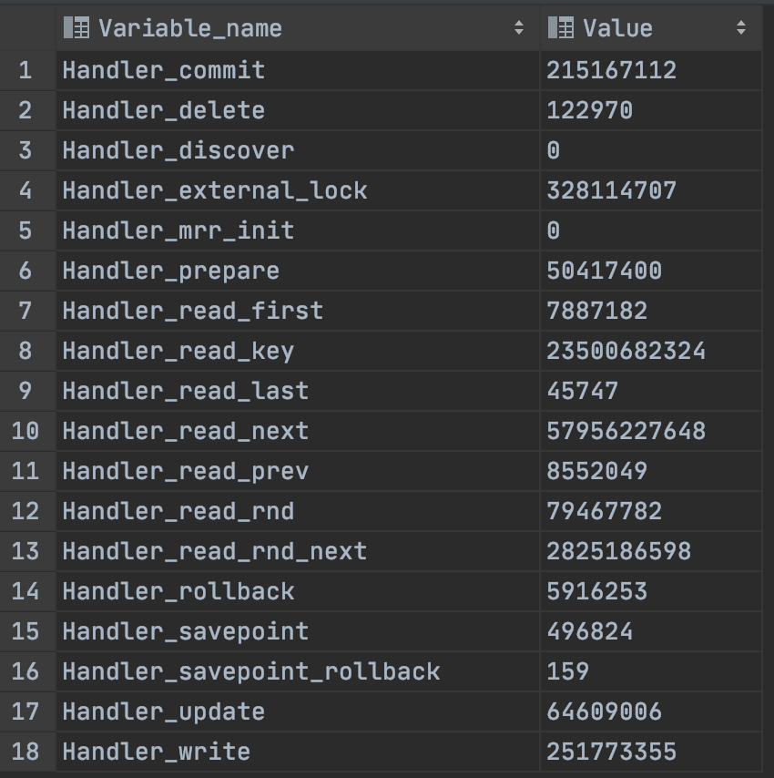

## 1주차 아키텍처

## 1.1 MySQL 전체구조

MySQL는 크게 응용프로그램 / MySQL 서버 / 운영체제 & 하드웨어 나뉘고

MySQL 서버는 크게 MySQL 엔진 / 스토리지 엔진으로 구분해서 볼 수 있다. 

### MySQL 엔진

- 클라이언트로부터 접속 및 쿼리 요청을 처리하는 커넥션 핸들러
- SQL 파서 및 전처리기
- 옵티마이저

3가지가 중심을 이룬다. 또한 성능 향상을 위해 MyISAM의 키 캐시, InnoDB의 버퍼 풀, 보조 저장소 기능이 포함되어있다.

### 스토리지 엔진

MySQL엔진은 요청된 SQL 문장을 분석하거나 최적화하고

실제 데이터를 디스크 스토리지에 저장하거나 디스크 스토리지로부터 데이터를 읽어오는 부분은 스토리지 엔진이 전담한다. 

MySQL 서버에서 MySQL 엔진은 하나지만 스토리지 엔진은 여러개를 사용할 수 있다. 

### 핸들러 API

MySQL 엔진의 쿼리 실행기에서 데이터 쓰거나 읽어야 할 때는 스토리지 엔진에게 요청을 "핸들러 요청"이라고 한다. 

핸들러 API를 이용해 MySQL 엔진과 데이터를 주고 받는다. 

~~~sql
show global status like 'Handler%'
~~~

: show status - MySQL 데이타베이스의 현재 상황을 확인한다. 

global : 시스템 전역 변수값 반대로 SESSION이 존재하고 현재 연결에 유요한 값을 표시한다.

- referencs : https://dev.mysql.com/doc/refman/8.0/en/server-status-variables.html

 - Handler_read_first : Index의 첫번째 Node Access, FULL_INDEX_SCAN
 - Handler_read_key : 특정값으로 Tree Search를 통해 index Node를 선택하는 경우, INDEX_SEEK
 - Handler_read_next : 인덱스의 leaf노드들의 링크를 Range스캔할 경우
 - Handler_read_prev : 위와 반대로 역순 Range스캔
 - Handler_read_random : Sorting같은 Buffer에 저장된 row에 대한 Access
 - Handler_read_random_next : 데이터Block나 Temp Table에서 순차적으로 row를 읽는 경우,FULL_TABLE_SCAN

: 추후 index에서... 

## 1.2 스레딩 

프로세스 기반이 아닌, 스레드 기반으로 

포그라운드 / 백그라운드 두가지로 구분된다.

SQL 쓰기 작업은 지연(버퍼링)되어 처리될 수 있지만, 읽기 작업은 절대로 지연될 수 없다.

일반적으로 DBMS는 쓰기 작업은 버퍼링을 통한 일괄처리 기능이 탐재되어 있다. (InnoDB)

MyISAM의 경우는 사용자가 스레드가 직접 쓰기 작업까지 처리한다.

이러한 이유로 InnoDB에서는 insert / update / delete 디스크에 저장될떄가지 기다리지 않아도 되지만 

MyISAM의 경우 버퍼링 기능을 사용할 수 없다.

### 포그라운드(클라이언트) = 사용자 스레드

MySQL 서버에 접속된 클라이언트의 수만큼 존재하며 주로 클라이언트 사용자가 요청하는 쿼리 문장을 처리하는 것이 임무다.

클라이언트가 작업을 마치고 커넥션을 종료하면 해당 커넥션을 담당하던 스레드는 다시 스레드풀로 돌아간다.

만약 thread_cache_size보다 많으면 스레드풀로 돌아가지 않는다.

MySQL의 데이터 버퍼나 캐시로부터 데이터를 가져오고, 버퍼나 캐시에 없는 경우 직접 인덱스 파일로부터 데이터를 읽어와서 처리한다.

MyISAM 테이블 디스크 쓰기 작업까지 포그라운드 스레드가 처리하지만, InnoDB의 경우 디스크 기은 백그라운드 스레드가 처리한다.

### 백그라운드

마이아이삼의 경우에는 해당 사항이 별로 없다.

이노디비의 경우 인서트 버퍼, 로그 기록, 데이터 버퍼에서 디스크로 기록, 디스크에서 버퍼로 읽어들이는, 데드락 모니터링 등 여러가지 업무를 처리한다.

- 로그 스레드 : 로그를 디스크로 기록하는 작업
- 쓰기 스레드 : 버퍼의 데이터를 디스크로 내려 쓰는 작업, 해당 스레드 개수를 지정할 수 있다. (innodb_write_io_threads)

## 1.3 메모리 

크게 글로벌 / 로컬 두가지 영역으로 구분된다.

- 글로벌 : MySQL 서버가 시작되면서 운영체제로부터 할당된다 .

MySQL 수많은 스레드가 공유하는 자원이 글로벌, 아니면 로컬

- 로컬 : 세션 메모리 영역이라고 표현하며 클라이언트 스레드가 쿼리를 처리하는데 사용하는 메모리 영역이다. 

커넥션이 열려 있는 동안 남아있는 공간 (버퍼)과 쿼리 실행하는 순간에만 할당했다가 사라지는 공간(소트버퍼, 조인버퍼)도 있다.

## 1.4 플러그인 스토리지 엔진 모델 

MySQL의 독특한 구조?로 플러그인 모델이 있다. 

전문 검색 엔진을 위한 파서(인덱싱할 키워드를 분리)도 플러그인 형태로 개발해서 사용할 수 있다. 

### 쿼리 실행 과정 

- SQL 파서 -> SQL 옵티마이저 -> SQL 실행기 -> 데이터 읽기/ 쓰기 -> 디스크 
(MySQL 엔진의 처리 영역) ------------------/(스토리지 엔진의 처리 영역) / 디스크 

데이터 읽기 / 쓰기 작업은 거의 대부분 1건의 레코드 단위로 처리된다. 

핸들러라는 표현을 자주 볼 수 있을텐데, 이는 소스코드로부터 넘어온 표현이다. 

Group By , Order By 와 같은 복잡한? 쿼리는 스토리지 엔진 영역이 아니라 MySQL 처리 영역인 쿼리 실행기에서 처리된다. 

스토리지 엔진에 따라서 데이터 읽기 / 쓰기 많이 달라진다는 소리이다. 

### show engines 

~~~sql
show engines 
~~~
- YES : 서버에 포함돼 있고, 사용 가능 
- DEFAULT : 필수 엔진, 없으면 MySQL이 시작될 수 없음 
- NO : 포함되지 않음 
- DISABLED : 포함됐지만, 파라미터에 의해 비활성화

### show plugins 

엔진 뿐만 아니라, 플러그인 살펴 볼 수 있다.
~~~sql
show plugins 
~~~

## 1.5 쿼리 실행 구조 

0. 쿼리 요청 
1. 쿼리 컴파일러 
   - 2.1 쿼리 파서 
   - 2.2 전처리기 
   - 2.3 옵티마이저 (쿼리 변환, 비용 최적화, 실행계획 개선)
2. 쿼리 실행기 
3. 스토리지 엔진 
4. 하드웨어 
5. 스토리지 엔진
6. 쿼리실행기
7. 응답 
  
### 파서 

쿼리 문장을 토큰으로 분리하는 작업으로 트리 형태의 구조로 만들어 내는 작업이다. 문법 요류가 이 과정에서 발견된다.

토큰 : MySQL이 인식할수 있는 최소 단위
    
### 전처리기 

파서 과정에서 만들어진 파서 트리를 기반으로 쿼리 문장에 구조적인 문제점이 있는지 확인한다. 

테이블 이름, 컬럼 이름, 권한과 같은 체크이다. 

### 옵티마이저 

최적화 쿼리를 담당한다. 

### 실행 엔진 

옵티마이저가 두뇌라면, 실행헨진은 손과 발로 비유 할 수 있다. 

실행엔진은 만들어진 계획대로 각 핸들러에게 요청해서 받은 결과를 또 다른 핸들러 요청의 입력으로 연결하는 역할을 수행한다.

= 파이프라인?
    
### 핸들러 (스토리지 엔진)
MySQL 서버의 가장 밑단에서 MySQL 실행 엔진의 요청에 따라 데이터를 디스크로 저장하고 디스크로부터 읽어 오는 역할을 담당한다.

핸들러는 결국 스토리지 엔진을 의미하며, MyISAM 테이블을 조작하는 경우에는 핸들러가 MyISAM 스토리지 엔진이 되고, InnoDB 테이블을 조작하는 경우

핸들러가 InnoDB 스토리지 엔진이 된다. 

## 1.6 복제 

복제는 리플리케이션이라고 하는데, 복제는 2대 이상의 MySQL 서버가 동일한 데이터를 담도록 실시간으로 동기화하는 기술이다. 

마스터-슬레이브 구조를 사용한다.

### 마스터 

MySQL의 바이너리 로그가 활성화되면 어떤 MySQL 서버든 마스터가 될 수 있다.

애플리케이션 입장에서 본다면 마스터 장비는 주로 데이터가 생성 및 변경 삭제되는 주체라고 볼 수 있다.

데이터 구조 변경 쿼리는 바이너리 로그에 기록하고, 슬레이브 서버에서 바이너리 로그를 읽는다.

Binlog dump 스레드가 해당 업무를 담당하는 스레드이다. 

### 슬레이브 

슬레이브 서버는 릴레이 로그를 가지고 있다. 

마스터로부터 변경 내역을 요청하고 받아온 변경 내역을 릴레이 로그에 기록한다. 

릴레이 로그에 기록된 변경 내역을 재실행하여 마스터와 동일한 상태로 유지한다. 

- 슬레이브는 하나의 마스터만 설정 가능

- 마스터/슬레이브 동기화를 위해 슬레이브는 읽기 전용으로 설정

- 슬레이브 서버는 마스터와 동일한 사양이 적합 
: 수많은 데이터 변경 쿼리가, 슬레이브에서는 하나의 스레드로 모두 처리돼야 한다. 
변경이 잦은 서버일수록 슬레이브 서버의 사양이 더 좋아야 한다. 대게 변경은 조회의 1/10이라 동일한 사양으로..

- 복제가 불필요할 경우 바이너리 로그 중지 
: 바이너리 로그를 생성하기 위해 많은 자원을 소모한다.

로그를 안정적으로 기혹하기 위해 Gap lock, 트랜잭션 커밋마다 쿼리 문장을 바이너리 로그에 기록해야 한다.

AutoCommit이 활성화되면 더욱 심각한 부하로 나타나는데, MyISAM의 경우 AutoCommit라 더욱 많은 자원을 소모한다.

- 바이너리 로그와 트랜잭션 격리 수준 

: 바이너리 기록 방식에 따라서 statement 포맷 방식과 row 포맷 방식이 있다. 

statement의 경우 마스터에서 실행되는 쿼리 문장을 기록하는 방식이며, row 포맷은 마스터에서 실행된 쿼리에 의해 변경된 레코드의 값을 기록하는 방식이다.

statement는 아무리 데이터를 많이 변경하더라도 sql 문장으로 전달히개 때문에 트래픽이 적지만, 정상 복제를 위해서 repeatable-read 사용한다.

반면 row 기반은 트래픽이 많이 발생히지만 read-commit 사용 가능하다.

## 1.7 쿼리 캐시

쿼리 캐시는 단어의 의미와는 달리 SQL 문장을 캐시하는 것이 아니라 **쿼리의 결과**를 메모리에 캐시해 두는 기능이다. 

### 처리 절차 
1. 요청된 쿼리 문장이 캐시에 존재하는가?
2. 결과를 볼 수 있는 권한이 있는가??
3. 트랜잭션 내에서 실행된 쿼리인 경우, 그 결과가 가시 범위 내의 트랜잭션에서 만들어진 결과인가?? (InnoDB)
4. 쿼리에 사용된 기능이 캐시돼도 동일한 결과를 보장할 수 있는가??
    - SYSDATE, RAND 등과 같은 호출 시점에 달라지는 값
    - 프리페어 스테이트먼트의 경우 변수가 결과가 영향을 주는가?
5. 캐시가 만들어지고 난 이후 해당 데이터가 다른 사용자에 의해 변경되지 않았는가?
6. 쿼리에 의해 만들어진 결과가 캐시하기에 너무 크지 않을까?
7. 그 밖에 쿼리 캐시를 사용하지 못하게 만드는 요소가 사용됐는가?

    

