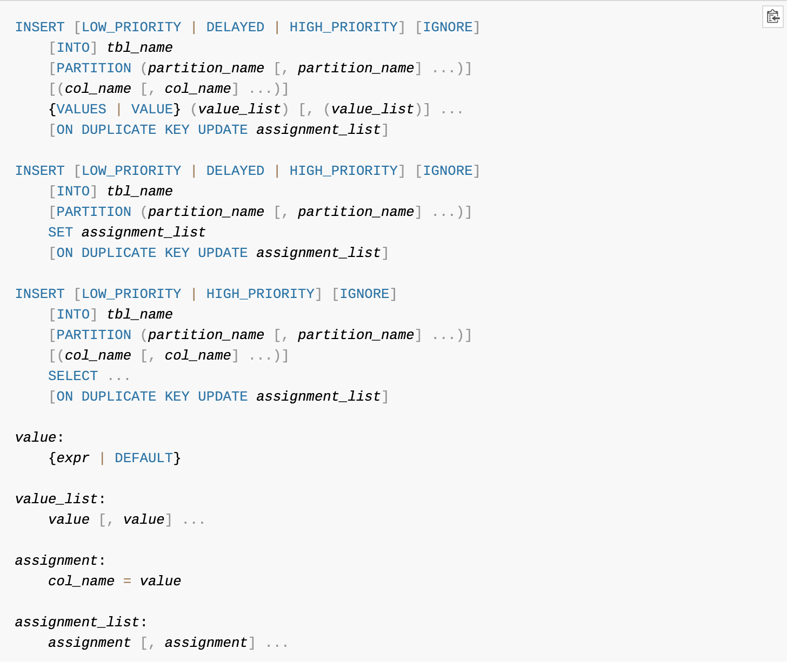

### 6.2.10 Extra
- 성능과 관련된 몇개의 고정된 문장이 표시됨
- 해당 컬럼을 통해 쿼리가 어떤 방식으로 실행이 되고 있는지 알 수 있는 중요한 컬럼  


#### **const row not found(MySQL 5.1 부터)**
- 쿼리 실행 계획에서 const 로 읽었지만 const에 해당하는 레코드가 없음


#### **Distinct**
- 조인하지 않아도 되는 항목은 모두 무시하고 필요한 레코드를 유니크하게 가져오기 위한 표현


#### **Full scan on NULL key**
- col1 IN (select  col2 from ...) 과 같은 쿼리에서 발생함
- col1 이 null 일 경우 해당 연산 조건은 아래와 같음
  - 서브 쿼리가 1건이라도 결과 레코드를 가진다면 최종 비교 결과는 NULL
  - 서브 쿼리가 1건도 결과 레코드를 가지지 않는다면 최종 비교 결과는 FALSE
- 위 두 연산 조건 때문에 서브 쿼리가 1건이라도 데이터가 있는지 없는지 알기 위해서는 full table scan 이 발생한다.
- col1 IN (select  col2 from ...) 조건절 앞에 col1 is not null 조건이 있다면 col1이 null일 경우 실행이 안되기 때문에 해당 상황을 피해갈 수 있다.


#### **Impossible HAVING(MySQL 5.1 부터)**
- HAVING 조건절에 해당하는 레코드가 없을 때 표시되는 키워드
- 쿼리 내용을 다시 점검하는게 좋음

#### **Impossible WHERE(MySQL 5.1 부터)**
- Impossible HAVING 과 비슷하게 WHERE 조건이 항상 FALSE 일 경우 표시되는 키워드
- 쿼리 내용을 다시 점검하는게 좋음

#### **Impossible WHERE noticed after reading const tables**
- 조건을 비교하는 부분에서 옵티마이저가 미리 쿼리를 실행해 볼 수 있고, 이것을 const 방식으로 비교 진행할 수 있을 때(대표적으로 프라이머리키를 기반), 비교 조건에 일치하는 조건이 없을 경우 표시되는 키워드
  
#### **No matching min/max row (MySQL 5.1 부터)**
- MIN(), MAX()와 같은 집합 함수가 있는 쿼리의 조건절에 일치하는 레코드가 없을 때 표시

#### **no matching row in const table (MySQL 5.1 부터)**
- 조인이 사용된 테이블에서 const 방식으로 접근할때 일치하는 레코드가 없다면 표시되는 키워드
  
> const 라는 키워드가 들어가면 옵티마이저가 내부적으로 실행을 해서 상수형식으로 만드는 과정이 있다고 생각하면 편함

#### **No tables used (MySQL 5.0 의 "No tables"에서 키워드 변경됨)**
- from 절이 없는 쿼리에서 표시되는 키워드

#### **Not exists**
- A 테이블에는 존재하지만 B 테이블에는 존재하지 않는 값을 조회할때 안티-조인을 실행하는데 left outer join 을 통해서도 표현 가능
- outer join 을 통해 안티-조인을 실행하면 "Not exists" 형식의 최적화를 통해 실행했다는 것을 표현하는 키워드
- SQL 문법에 NOT EXISTS 와는 다른 의미

#### **Range checked for each record (index map: N)**
- 두 테이블을 조인할때 조건문을 확인해서 매 레코드마다 인덱스 레인지 스캔을 체크해야할 때 표현하는 키워드
- (index map: N) 에서 N은 어떤 인덱스를 후보로 해당 레인지 스캔을 실행하지에 대한 비트가 표시된다.
  ```sql
  select *
    from employees e1, employees e2
   where e1.emp_no <= e2.emp_no;
  ```
  

#### **Scanned N databases(MySQL 5.1부터)**
- INFORMATION_SCHEMA DB를 조회할 때 N개의 DB 정보를 읽었는지 표현하는 키워드

#### **Select tables optimized away**
- MIN(), MAX() 가 사용될때 인덱스를 오름차순/내림차순으로 한건만 읽는 형태의 최적화가 적용되거나 MyISAM 엔진에서 COUNT(*)를 사용할때 표현하는 키워드

#### **Skip_open_table, Open_frm_only, Open_trigger_only, Open_full_table (MySQL 5.1부터)**
- Scanned N databases과 동일하게 INFORMATION_SCHEMA DB의 메타 정보 조회를 할 때 발생한다.
- 메타 정보가 저장된 파일과 트리거가 저장된 파일 또는 데이터 파일 중에서 필요한 파일만 읽었는지 등을 나타낸다.

#### **unique row not found (MySQL 5.1부터)**
- 유니크 컬럼으로 두 테이블을 outer join 하였을때 아웃터 테이블에 일치하는 레코드가 존재하지 않을 때 표시되는 키워드

#### **Using filesort**
- order by 작업시 인덱스를 사용하지 못할때 표시되는 키워드
- 조회된 레코드를 메모리 버퍼에 복사해 퀵소트 알고리즘을 수행하게 됨

#### **Using index(커버링 인덱스)**
- 데이터 파일을 전혀 읽지 않고 인덱스만 읽어서 쿼리를 모두 처리할 수 있을 때 표시되는 키워드
- 인덱스를 이용해 처리할 때 인덱스를 검색해 일치하는 레코드의 나머지 컬럼을 가져오기 위해 데이터 파일을 찾아서 가져오는 작업이 부하가 큰 작업임
- 만약 조회에 필요한 컬럼이 모두 인덱스에 있다면 나머지 컬럼들을 찾기 위한 I/O 작업이 필요 없어짐
- 이렇게 인덱스만으로 처리되는 것을 커버링 인덱스라고 함
- 하지만 너무 과도한 인덱스들은 메모리 낭비와 변경 작업이 느려지는 상황을 발생시킨다

#### **Using index for group-by**
- GROUP BY 처리를 위해 기준 칼럼을 정렬하고 그룹핑 하는 형태의 작업이 이루어짐
- 만약 GROUP BY 처리가 인덱스를 사용한다면 레코드의 정렬이 필요하지 않고 필요한 부분만 읽는 '루스 인덱스 스캔' 을 사용할 수 있다. 
- 하지만 COUNT()나 SUM()과 같은 함수는 모든 레코드를 읽어야 하기 때문에 '루스 인덱스 스캔'을 사용하지 못함
- 또한 WHERE  조건절이 인덱스를 사용하지 않는다면 조건 비교를 위해 '루스 인덱스 스캔'을 사용하지 못함
- WHERE 조건절이 검색을 위해 인덱스를 사용한다고 해도 '루스 인덱스 스캔'에 사용되는 인덱스와 다른 인덱스를 사용할 경우 옵티마이저는 WHERE 절 인덱스를 키준으로 최적화 시키는 경향이 있다.

#### **Using join buffer (MySQL 5.1부터)**
- 일반적으로 조인을 할 때 조인이 되는 칼럼은 인덱스를 생성한다. 두 테이블 모두 필요한 건 아니고 조인에서 뒤에 읽는 테이블의 컬럼에만 필요한다.
- 먼저 읽는 테이블을 드라이빙 테이블, 뒤에 읽히는 테이블을 드리븐 테이블이라고 한다.
- 드리븐 테이블에 검색을 위한 적절한 인덱스가 없다면 드라이빙 테이블로부터 읽은 레코드의 건수만큼 매번 드리븐 테이블을 풀 테이블 스캔이나 인덱스 풀 스캔을 해야한다.
- 그렇기 때문에 드라이빙 테이블에서 읽은 레코드를 임시공간(조인버퍼)에 보관해두고 필요할 때 재사용할 수 있게 해준다.
- 이런 작업이 발생할 때 표시되는 키워드이다.

#### **Using sort_union(...), Using union(...), Using intersect(...)**
- 실행 계획 type 컬럼 값이 index_merge일 경우 2개 이상의 인덱스가 동시에 사용될 수 있다. 
- 이때 두 인덱스로부터 읽은 결과를 어떻게 병합했는지 설명하기위한 키워드
  - Using intersect(...) : 조건이 AND 이고 처리 결과에서 교집합을 추출해 내는 작업
  - Using union(...) : 조건이 OR 이고 처리 결과에서 합집합을 추출해 내는 작업
  - Using sort_union(...) : OR 연결이고 상대적으로 대량의 rnage 조건일 경우 사용

#### **Using temporary**
- 쿼리 처리중 임시 테이블을 사용할때 표시되는 키워드 (임시 테이블이 메모리 또는 디스크에 생성되었는지는 실행계획으로는 알 수 없다.)
- 인덱스를 사용하지 못하는 GROUP BY 쿼리는 실행계획에서 'Using temporary' 메시지가 표시되는 가장 대표적인 형태의 쿼리이다.
- 그리고 해당 키워드가 표시되지 않고도 임시테이블을 이용한 처리를 할 때도 있다.

#### **Using where**
- MySQL 엔진 레이어에서 별도의 가공을 해서 필터링 작업을 처리한 경우에만 해당 키워드가 표시된다.
- 보통 범위제한 조건은 스토리지 엔진레벨에서 처리되지만 체크 조건은 MySQL 엔진 레이어에서 처리된다.
- 해당 키워드는 자주 표시가 되는 키워드라 무시하기 쉽지만 스토리지 엔진과 MySQL 엔진이 이원화 되어 있어서 발생하는 문제점을 나타내는 것일 수도 있다.
- 일반적으로 MySQL 엔진 과 스토리지 엔진이 하나의 프로세스로 동작하는 구조가 아닌 분리되어 있는 NDB 같은 경우 문제가 발생할 확률이 큼
- 인덱스가 필터링 작업이 아닌 범위 작업으로 동작할 수 있도록 해서 문제를 해결할 수 있다.
- 또한 스토리지 엔진 레벨에서 체크 조건도 처리할 수 있도록 하는 기능을 "Condition push down" 이라고한다.

#### **Using where with pushed condition**
- 해당 키워드는 "Condition push down"이 적용됐음을 의미하는 메시지이다.
- 하지만 해당 키워드는 NDB 클러스터 스토리지 엔진을 사용하는 테이블에서만 표시되는 메시지다.
- NDB 에서는 MySQL엔진 역할을 하는 하는 SQL 노드와 스토리지 엔진 연학을 하는 데이터 노드 사이에 "Condition push down" 적용되지 않으면 큰 부하가 있기 때문에 중요한 키워드이다.

### 6.2.11 EXPLAIN EXTENDED (Fitered 칼럼)
- 모든 레코드가 스토리지 엔진에서 처리되어 가져오는것은 아니다. 여러 이유로 인해서 스토리지 엔진에서 읽어와서 MySQL 엔진에서 필터링되고 있다.
- 이때 필터링되어 제거된 레코드는 제외하고 최종적으로 레코드가 얼마 남았는지 비율이 표시된다. 해당 내용을 담은 컬럼이 'Fitered 칼럼' 이다.

### 6.2.12 EXPLAIN EXTENDED (추가 옵티마이저 정보)
- MySQL 엔진에서 생성한 파스 트리를 재좋바해서 쿼리 문장과 비슷한 순서대로 나열해서 보여준다.
- 옵티마이저가 쿼리를 어떻게 해석했고, 어떻게 쿼리를 변환했으며, 어떤 특수한 처리가 수행됐는지 등을 판단할 수 있다.

### 6.2.13 EXPLAIN PARTITIONS (Partitions 칼럼)
- 파티션 테이블의 실행 계획 정보를 더 자세히 확인할 수 있다.
- 쿼리를 실행하기 위해 테이블의 파티션 중에서 어떤 파티션을 사용했는지 등의 정보를 조회할 수 있다.
- 불필요한 파티션을 빼고 쿼리를 수행하기 위해 접근해야할 것으로 판단되는 테이블만 골라내는 과정을 파티션 프루닝이라고 한다.
- EXPLAIN PARTITIONS 명령은 파티션 테이블에 실행되는 쿼리가 얼마나 파티션 기능을 잘 활용하고 있는지를 판단할 수 있는 자료를 제공한다.


## 6.3 MySQL의 주요 처리 방식
- 많은 처리 방식들이 스토리지 엔진이 아니라 MySQL 엔진에서 처리된다.
- MySQL 엔진에서 부가적으로 처리하는 작업은 대부분 성능에 미치는 영향력이 크다.
- 스토리지 엔진에서 읽은 레코드를 MySQL 엔진이 아무런 가공작업없이 사용자에게 반환한다면 최상의 성능을 보장하는 쿼리가 되겠지만 대부분 그렇지 않다.

### 6.3.1 풀 테이블 스캔
- 풀 테이블 스캔은 인덱스를 사용하지 않고 테이블의 데이터를 처음부터 끝가지 읽어서 요처된 작업을 처리하는 작업을 의미한다.
  - 테이블의 레코드 건수가 너무 작아서 인덱스를 통해 읽는 것 보다 풀 테이블 스캔을 한느 편이 더 빠를 경우 
  - WHERE 절이나 ON 절에 인덱스를 이요할 수 있는 적절한 조건이 없는 경우
  - 인덱스를 사용할 수 있더라도 조건 일치 레코드 건수가 너무 ㅁ낳은 경우
  - max_seeks_for_key 변수를 설정할 경우
- InnoDB 스토리지 엔진은 특정 테이블의 연속된 데이터페이지가 읽히면 백그라운드 스레드에 의해 리드 어헤드(Read ahead) 작업이 자동으로 시작된다.
- 리드 어헤드란 요청이 오기전 필요하다고 예상되는 데이터를 디스크에 읽어서 버퍼 풀에 가져다 두는것을 말한다.

### 6.3.2 ORDER BY 처리(Using filesort)
- 정렬을 처리하기 위해서는 인덱스를 이용하는 방법과 쿼리가 실행될 때 "Filesort"라는 별도의 처리를 이용하는 방법으로 나눌 수 있다.
  - 인덱스를 이용
    - 장점 : I/U/D 쿼리가 실행될때 이미 인덱스가 정렬돼 있어서 순서대로 읽기만 하면 되므로 매우 빠르다.
    - 단점 : I/U/D 작업시 부가적인 인덱스 추가/삭제 작업이 필요하므로 느리다.
  - Filesort 이용
    - 장점 : 정렬해야 할 레코드가 많지 않으면 메모리에서 Filesort가 처리되므로 충분히 빠르다.
    - 단점 : 대상 레코드 건수가 많아질수록 쿼리의 응답 속도가 느리다.
  
- 모든 정렬을 인덱스를 이용하도록 튜닝하기란 거의 불가능하다.
  - 정렬 기준이 너무 많아서 요건별로 모두 인덱스를 생성하는 것이 불가능한 겨ㅑㅇ우
  - GROUP BY 또는 DISTINCT 와 같은 처리의 결과를 정렬해야할 경우
  - UNION 의 결과와 같이 임시 테이블의 결과를 다시 정렬해야 할 경우
  - 랜덤하게 결과 레코드를 가져와야 하는 경우
- MySQL 정렬이 어떻게 처리 될까?

#### **소트 버퍼**
- 정렬을 수행하기 위한 별도의 메모리 공간
- 정렬에 필요한 레코드 건수가 소트 버퍼로 할당된 공간보다 크면 레코드를 여러 조각으로 나눠서 처리하는데, 이때 임시저장을 위해 디스크를 사용함
- 정렬을 수행하고, 임시 디스크에 기록하고, 다시 정렬하고 하는 행위 들이 반복된다.
- 이 작업들이 모두 디스크의 쓰기와 읽기를 유발하며, 레코드 건수가 많을 수록 이 반복 횟수가 늘어난다.
- 또한 소트 버퍼 영역은 세션 영역이라 여러 클라이언트가 공유할 수 없다. 즉 커넥션이 많으면 많을 수록 메모리 공간이 커진다.
- 너무 많은 메모리를 사용할 경우 운영체제에 의해 강제로 종료될 수 있다.

#### **정렬 알고리즘**
- 레코드 전체를 소트 버퍼에 담을지 또는 정렬 기준 칼러만 소트 버퍼에 담을지에 따라 2가지 정렬 알고리즘으로 나눠볼 수 있다.
  - 싱글 패스 알고리즘
    - 소트 버퍼에 정렬 기준 칼럼을 포함해 SELECT되는 칼럼 전부를 담아서 정렬을 수행하는 방법
  - 투 패스 알고리즘
    - 정렬 대상 칼럼과 프라이머리 키값만을 소트 버퍼에 담아서 정렬을 수행하고 순서대로 다시 프라이머리 키로 테이블을 읽어서 SELECT 할 칼럼을 가지고 오는 알고리즘
- 예전에는 투 패스 알고리즘을 많이 사용했고 최근에는 커진 메모리 크기로 덕분에 싱글 패스 알고리즘을 더 많이 사용한다.
- 두가지 방법을 절적히 섞어서 정렬을 진행한다.

#### **정렬의 처리 방식**
- 인덱스를 사용한 정렬
  - 실행 계획 extra 코멘트에 별도의 내용 표기 없음
  - ORDER BY에 명시된 컬럼이 제일 먼저 읽는 테이블(조인일 경우 드라이빙 테이블)에 속하고, ORDER BY의 순서대로 생성된 인덱스가 있어야한다.
  - 또한 WHERE 절에 첫 번째 읽는 테이블의 컬럼에 대한 조건과 ORDER BY컬럼은 같은 인덱스를 사용해야 한다.
  - 인덱스를 이용한다고 해서 ORDER BY 절을 제거하는건 위험함
- 드라이빙 테이블만 정렬(조인이 없는 경우 포함)
  - "Using filesort"가 표시됨
  - 조인에서 첫 번째 읽히는 테이블(드라이빙 테이블)의 컬럼만으로 ORDER BY 절이 작성돼야 한다.
  - 정렬 된 후 드리븐 테이블과 조인을 실행해서 결과를 가져옴
- 조인 결과를 임시 테이블로 저장한 후, 임시 테이블에서정렬
  - "Using temporary; Using filesort"가 같이 표시됨
  - '드라이빙 테이블만 정렬' 과는 다르게 정렬 기준 컬럼이 드리븐 테이블에 있을 경우 조인된 데이터를 가지고정렬할 수 밖에 없다.
  - 조인 결과를 임시 테이블에 저장하고, 그 결과를 다시 정렬한다.
- 정렬 처리 방식중 인덱스를 사용한 정렬만 스트리밍 방식으로 클라이언트에게 데이터를 전달 할 수 있고, 나머지 두 방법은 버퍼링 방식으로 클라이언트에게 데이터를 전달 할 수 있다. 그렇기 때문에 '인덱스를 사용한 정렬' 을 사용하면 클라이언트는 빠르게 데이터를 바로바로 받아 볼 수 있다.

#### **정렬 관련 상태 변수**
- MySQL 서버는 주요 작업에 대해 해당 작업의 실행 횟수를 상태 변수로 저장하고 있다.
  - Sort_merge_passes : 멀티 머지(소트 버퍼 간의 병합 작업) 처리 횟수 
  - Sort_range : 인덱스 레인지 스캔을 통해 검색된 결과에 대한 정렬 작업 횟수
  - Sort_scan : 풀 테이블 스캔을 통해 검색된 결과에 대한 정렬 작업 횟수다.
  - Sort_rows : 지금가지 정렬한 전체 레코드 건수

### 6.3.3 GROUP BY 처리
- GROUP BY 작업도 인덱스를 사용하는 경우와 그렇지 못한 경우로 나눠 볼 수 있다.
- 인덱스를 사용할 때
  - 인덱스 스캔
  - 루스 인덱스 스캔
- 인덱스를 사용하지 못할 때
  - 임시 테이블 이용

#### **인덱스 스캔을 이용하는 GROUP BY(타이트 인덱스 스캔)**
- 드라이빙 테이블에 속한 컬럼만 사용해 그룹핑할 때 인덱스가 있다면 인덱스를 읽으면서 그룹핑 작업을 수행한다.
- 그렇기 때문에 index 스캔이 일어난다.
- 예시
```sql
-- 인덱스는 (c1, c2, c3)
SELECT c1, c2, c3 FROM t1 WHERE c2 = 'a' GROUP BY c1, c3;
```
- 위와 같은 설정일 경우 c1, c3 만을 사용해 GROUP BY 를 하고 있지만 c2 를 where 절에 사용하여 타이트 인덱스 스캔을 사용할 수있다.


#### **루스 인덱스 스캔을 이용하는 GROUP BY**
- 인덱스의 레코드를 건너뛰면서 필요한 부분만 가져오는 것을 의미
- 루스 인덱스 스캔방식은 단일 테이블에 대해 수행되는 GROUP BY 처리에만 사용할 수 있다.
- 인덱스 스캔에서는 유니크한 값의 수가 적을수록 성능이 향상되는 반면 루스 인덱스 스캔에서는 인덱스의 유니크한 값의 수가 적을수록 성능이 향상된다.
- 별도의 임시 테이블이 필요하지 않다.
- [책에 나오는 예제](https://dev.mysql.com/doc/refman/5.7/en/group-by-optimization.html)

#### **임시 테이블을 사용하는 GROUP BY**
- 인덱스를 사용하지 못할때 이 방식으로 처리 된다.
- 조인이 있다면 조인 결과를 임시 테이블에 저장한다. 
- 이때 GROUP BY를 한 컬럼과 SELECT 에 사용되는 컬럼만 저장한다. 또한 GROUP BY 절에 사용된 컬럼으로 유니크 키를 만든다.

### 6.3.4 DISTINCT 처리
- 특정 컬럼의 유니크한 값만을 조회하기 위해 DISTINCT 를 사용한다.
- 집합 함수와 함께 사용하는 경우 / 집합 함수가 없는 경우 두가지로 구분해서 사용할 수 있다.

#### **SELECT DISTINCT ...**
- SELECT  되느 레코드 중에서 유니크한 레코드만 가져오고 싶으면 SELECT DISTINCT 형태의 쿼리 문장을 사용한다.
- GROUP BY 와 거의 같은 방식으로 처리 되지만 정렬이 보장되지 않는다는 것뿐이다.
- DISTINCT 는 SELECT 하는 레코드를 유니크하게 SELECT 하는 것이지 칼럼을 유니크하게 조회하는것이 아니다.

#### **집합 함수와 함께 사용된 DISTINCT**
- COUNT(), MIN(), MAX() 와 같은 집함 함수 내에서 DISTINCT  키워드가 사용될 수 있음
- 집합 함수 결과를 처리하기 위해 임시 테이블을 사용한다. 다만 쿼리 실행 계획에는 표시되지 않는다.
- 생성된 임시 테이블은 유니크인덱스를 가지기 때문에 레코드 건수가 많아지면 상당히 느려질 수 있다.
- 두개의 집함 함수를 만들 경우 두개의 임시 테이블을 만든다.
- 인덱스된 칼럼에 대해서는 인덱스 풀스캔 또는 레인지스캔을 통해 임시 테이블 없이 최적화 된다.


### 6.3.5 임시 테이블(Using temporary)
- MySQL 엔진이 스토리지 엔진으로부터 받아온 레코드를 정렬하거나 그룹핑할 때는 내부적인 임시 테이블을 사용한다.
- 일반적으로 MySQL 엔진이 사용하는 임시테이블은 처음에는 메모리에 생성됐다가 테이블 크기가 커지면 디스크로 옮겨진다.
- 임시 테이블이 메모리를 사용할 때는 MEMORY 스토리지 엔진을 사용하며,디스크에 저장된 때는 MyISAM 스토리지 엔진을 사용한다.
- 임시 테이블은 쿼리의 처리가 완료되면 자동으로 삭제된다.

#### **임시 테이블이 필요한 쿼리**
- 임시 테이블을 만드는 대표적인 케이스
  - ORDER BY 와 GROUP BY 에 명시된 칼럼이 다른 쿼리
  - ORDER BY 와 GROUP BY 에 명시된 칼럼이 조인의 순서상 첫 번째 테이블이 아닌 쿼리
  - DISTINCT 와 ORDER BY 가 동시에 쿼리에 존재하는 경우 또는 DISTINCT가 인덱스로 처리되지 못하는 경우
  - UNION이나 UNION DISTINCT 가 사용된 쿼리(select_type 칼럼이 UNION RESULT 인 경우, 272p)
  - UNION ALL 이 사용된 쿼리(select_type 칼럼이 UNION RESULT 인 경우)
  - 쿼리의 실행 계획에서 select_type이 DERIVED인 쿼리 274p)
- 유니크 인덱스 내부 임시 테이블을 만들 경우 처리 성능이 상당히 느리다. (위 예제중 1~4 케이스, 중복이 없으면 유니크 인덱스를 만듬)

#### **임시 테이블 관련 상태 변수**
- 임시 테이블 생성장소가 디스크인지 메모리 인지 알기 위해서는 MySQL 서버의 상태변수(SHOW SESSION STATUS LIKE 'Created_tmp%';)를 확인해 보면 된다.
  - Created_tmp_tables : 모든 임시 테이블 개수 누적
  - Created_tmp_disk_talbes : 디스크에 만들어진 임시 테이블 개수 누적

#### **임시 테이블 관련 주의사항**
- 레코드 건수가 많지 않으면 임시 테이블이 메모리에 생성되 문제가 없지만 내부 임시 테이블이 MyISAM 테이블로 디스크에 생성되는 경우다.
- 임시 테이블이 디스크에 생성된다면 부하가 커짐
- 가능한 인덱스를 사용하고 임시 테이블이 필요하지 않게 만드는 걱이 좋다.
- 또한 MEMORY(HEAP) 테이블로 물리 메모리에 생성되는 경우 칼럼은 고정 크기 칼럼이라 컬럼 데이터가 작더라도 테이블에 정의된 크기만큼 메모레 테이블 공간을 차지함
- 그렇기 때문에 SELECT 되는 컬럼은 최소화가 필요
- BLOB, TEXT 칼럼은 최소화 하는게 좋음
- 데이터 타입 크기도 가능한 작게 하는게 좋음

### 6.3.6 테이블 조인
- MySQL은 네스트드-루프 형태의 조인을 지원

#### **조인의 종류**
- 조인의 종류는 크게 INNER JOIN과 OUTER JOIN으로 구분할 수 있다.
- OUTER JOIN 은 다시 LEFT OUTER JOIN과 RIGHT OUTER JOIN 그리고 FULL OUTER JOIN 으로 구분할 수 있으 
- 조인 조건에 따라서는 NATURAL JOIN과 CROSS JOIN(FULL JOIN, CARTESIAN JOIN)으로 구분할 수 있음


#### **JOIN (INNER JOIN)**
- 조인은 네스티드-루프 방식만 지원한다.
- 네스티드-루프 방식은 프로그램을 작성할 때 두개의 반복문을 실행하는 형태로 조인이 처리되는 것을 말한다.
  ```
  // INNER JOIN의 네스티드-루프 방식
  FOR ( record1 IN TABLE1) { // 외부 루프 (OUTER)
    FOR ( record2 IN TABLE2) { // 내부 루프 (INNER)
        IF ( record1.join_column == record2.join_column ) {
          join_record_found(record1.*, record2.*);
        } ELSE {
          join_record_notfound();
        }
    }
  }
  ```
- 여기서 바깥쪽을 OUTER, 안쪽을 INNER 라고 한다.
- OUTER 테이블은 이너 테이블보다 먼저 읽어야 하며, 조인에서 주도적인 역할을 한다고 해서 드라이빙 테이블이라고 한다.
- 반대로 이너 테이블은 끌려가는 역할이라고해서 드리븐 테이블이라고한다.
- 최종적으로 선택될 레코드가 안쪽 반복 루프에 의해 결정되는 경우를 INNER JOIN 이라고 한다.

#### **OUTER JOIN**

  ```
  // OUTER JOIN의 네스티드-루프 방식
  FOR ( record1 IN TABLE1) { // 외부 루프 (OUTER)
    FOR ( record2 IN TABLE2) { // 내부 루프 (INNER)
        IF ( record1.join_column == record2.join_column ) {
          join_record_found(record1.*, record2.*);
        } ELSE {
          join_record_found(recrod1.*, NULL);
        }
    }
  }
  ```
- TABLE2에 조건을 만족하는 레코드가 없는 경우 TABLE2의 컬럼을 모두 NULL로 채워서 가져온다.
- OUTER JOIN 에서는 일치하는 레코드를 찾지 못해도 결과를 버리지 않고 포함시킨다.
- 조인의 결과를 결정하는 아우터 테이블이 조인의 왼쪽에 있는지 오른쪽에 있는지에 따라 LEFT OUTER JOIN과 RIGHT OUTER JOIN, 그리고 FULLE OUTER JOIN으로 다시 나뉜다.
- MySQL에서는 FULLE OUTER JOIN을 지원하지 않지만 INNER JOIN과 OUTER JOIN을 조금만 섞어서 활용하면 같은 기능을 수행한다.
- 또한 레코드가 없을 수도 있는 쪽의 테이블에 대한 조건은 반드시 ON 절에 모두 명시해야한다.
- ON 절 조건은 레코드가 있을 때만 적용되지만, WHERE 절에 명시할 경우 조인된 결과에 대해 모두 적용하기 때문에 옵티마이저가 사용자의 의도와는 다르게 쿼리를 최적화 할 수 있다.
  
#### **카테시안 조인**
- FULL JOIN 또는 CROSS JOIN 이라고 부르며, JOIN 연결 조건없이 테이블의 모든 레코드 조합을 가지고 온다.
- 테이블 레코드 건수가 많다면 조인의 결과가 기하급수적으로 늘어나므로 사용시 주의가 필요하다.
- N개의 테이블의 조인이 수행되면 조인 조건은 최소한 N-1개가 필요하며 모든 테이블은 1번 이상 조인 조건을 사용해야 카테시안 조인을 피할 수 있다.
- MySQL 에서는 카테시안 조인과 이너 조인은 문법으로 구분되지 않고 조인에 필요한 적절한 조건이 있다면 이너조인으로 처리되고, 없다면 카테시안 조인이 된다.

#### **NATURAL JOIN**
- 조인 대상 테이블에 같은 이름을 가진 컬럼을 기준으로 조인을 실행
- 조인 조건을 명시하지 않아도 된다는 편리함이 있지만 원하지 않는 컬럼이 조건이 되어 조인이 일어날 수도 있다.
  
#### **Single-sweep multi join**
- "Single-sweep multi join" 의 의미는 조인에 참여하는 테이블의 개수만큼 FOR 나 WHILE 과 같은 반폭 루프가 중첩되는 것을 말한다.


#### **조인 버퍼를 이용한 조인 (Using join buffer)**
- 드라이빙 테이블에서 일치하는 레코드의 건수만큼 드리븐 테이블을 검색하면서 처리된다.
- 그렇기 때문에 드리븐 테이블에 인덱스를 사용하지 못한다면 드리븐 테이블을 풀 테이블 스캔해야하는 상황이 발생한다.
- 운이 나쁘게도 드리븐 테이블의 풀 테이블 스캔이나 인덱스 풀 스캔을 피할 수 없을 수 있다.
- 그렇다면 옵티마이저는 드라이빙 테이블에서 읽은 레코드를 메모리에 캐시한 후 드리븐 테이블과 이 메모리 캐시를 조인하는 형태로 처리한다.
- 조인 버퍼를 사용하지 않는 환경이라면 정렬 결과는 드라이빙 테이블의 순서에 의해 결정된다.
- 하지만 조인 버퍼를 사용한다면 드리븐 테이블 데이터를 캐시된 레코드와 조인하는 형태여서 정렬이 기존과는 다르게 흐트러질 수 있다.

#### **조인 관련 주의 사항 - 조인 실행 결과의 정렬 순서**
- 인덱스를 기준으로 정렬된 결과를 예측할 수 있다.
- 하지만 그것은 옵티마이저가 그것을 선택한 것이기 때문에 인덱스 기준으로 정렬된 것이지 항상 동일한 결과를 보장하는 것은 아니다.
- 그렇기 때문에 정렬을 원할 때에는 항상 ORDER BY 키워드를 사용해야 한다.

#### **조인 관련 주의 사항 - INNER JOIN과 OUTER JOIN의 선택**
- OUTER JOIN 을 실행하면 INNER JOIN 보다 느리다고 생각할 수 있다.
- 하지만 성능을 고려해서 선택하는게 아니라 업무 요건에 따라 선택하는 것이 바람직하다.
- 데이터의 구조나 특성을 모르고 INNER JOIN 이나 OUTER JOIN을 사용한다면 잘못 된 결과가 나올 수도 있다.

## 6.4 실행 계획 분석 시 주의사항

### 6.4.1 Select_type 칼럼의 주의 대상
#### **DERIVED**
- DERIVED는 FROM 절에 사용된 서브 쿼리로부터 발생한 임시 테이블을 의미한다.
- 일반적으로 메모리에 저장하는 경우에는 크게 성능에 영향을 미치지않지만, 디스크에 저장된다면 성능에 크게 영향을 미친다.

#### **UNCACHEABLE SUBQUERY**
- FROM 절 이외의 부분에서 사용하는 서브 쿼리는 가능하면 캐시되어 재사용 될 수 있게 유도한다.
- 하지만 사용자 변수나 일부 함수가 사용된 경우에는 캐시 기능을 사용할 수 없다.
- 그렇기 때문에 사용자 변수를 제거하거나 다른 함수로 대체해서 사용 가능할지 검토해 보아야 한다.

#### **DEPENDENT SUBQUERY**
- 서브 쿼리가 외부 쿼리에서 값을 전달받아 실행되는 경우 DEPENDENT SUBQUERY가 표시된다.
- 서브 쿼리가 먼저 실행되지 못하고 외부 쿼리 결과 값에 의존적이기 때문에 전체 쿼리의 성능을 느리게 만든다.
- 외부 쿼리의 의존도를 제거하는 것이 좋다.

### 6.4.2 Type 칼럼의 주의 대상
#### **ALL, index**
- index는 인덱스 풀 스캔을 의미하며, ALL은 풀 테이블 스캔을 의미한다.
- 둘 다 대상의 차이는 있지만 대상 전체 레코드를 읽어오는 작업 방식이라느리다.
- 새로운 인덱스를 추가하거나 쿼리의 요건을 변경해서 이러한 접근 방법을 제거하는 것이 좋다.

### 6.4.3 Key 칼럼의 주요 대상
- 쿼리가 인덱스를 사용하지 못할 때 실행 계획의 Key 컬럼에 아무값도 표시되지 않는다.
- 이때 인덱스를 추가하거나 WHERE 조건을 변경하는 것이 좋다.

### 6.4.4 Rows 칼럼의 주의 대상
- 쿼리가 실제 가져오는 레코드 수보다 훨씬 더 큰값이 Rows 칼럼에 표시되는 경우에는 인덱스를 정상적으로 사용하고 있는지 확인이 필요하다
- 또한 인덱스가 충분히 작업 범위를 좁혀줄 수 있는 컬럼인지도 검토해 보아야 한다.
- LIMIT 키워드와 상관없이 Rows 에는 모든 대상이 표시되는 방식이어서 최적화된 쿼리일 수도 있다.

### 6.4.5 Extra 컬럼의 주의 대상
  
#### **쿼리가 요건을 제대로 반영하고 있는지 확인해야 하는 경우**
- 아래 코멘트가 Extra 컬럼에 표시된다면 쿼리가 요건을 제대로 반영했는지, 버그가 생길 가능성은 없는지 확인해야 한다.
- 성능과는 크게 관계가 없고 단지 '그런 레코드가 없음' 이라는 의미가 강하기 때문이다.
- Full scan on NULL KEY
- Impossible HAVING(MySQL 5.1 부터)
- Impossible WHERE(MySQL 5.1 부터)
- Impossible WHERE noticed after reading const table
- No matching min/max row(MySQL 5.1 부터)
- No matching row in const table(MySQL 5.1 부터)
- Unique row not found(MySQL 5.1 부터)

#### **쿼리의 실행 계획이 좋지 않은 경우**
- 아래와 같은 코멘트가 표시 된다면 먼저 쿼리를 더 최적화 할 수 있는지 검토해보는 것이 좋다.
- 특히 Using where 은 대부분 쿼리에서 표시되는 경향이 있지만 실행 계획 Rows 컬럼 값과 select 되는 레코드 건수 차이가 클 경우 검토후 차이를 줄이는 작업이 필요하다.
- Range checked for each record (index map: N)
- Using filesort
- Using join buffer(MySQL 5.1 부터)
- Using temporary
- Using where

#### **쿼리의 실행 계획이 좋은 경우**
- 아래와 같은 코멘트가 표시된다면 최적화되어 처리되고 있음을 알려주는 지표 정도로 생각하자.
- 특히 커버링 인덱스같은 경우 MySQL에서 제공할 수 있는 최고의 성능을 보여줄 것이다.
- Distinct
- Using index (커버링 인덱스)
- Using index for group-by
  

# 7. 쿼리 작성 및 최적화
- 쿼리를 빠르게 수행되게 하려면 쿼리가 어떻게 데이터를 가져올지 예측할 수 있어야 한다. 
- 그렇기 때문에 규칙이나 옵티마이저 처리 방식에 대해 어느정도의 지식이 있어야 한다.


## 7.1 쿼리와 연관된 시스템 설정
### 7.1.1 SQL 모드
- sql_mode 라는 시스템 설정에 값을 설정할 수 있다.
#### **STRICT_ALL_TABLES**
- 일반적으로 저장하려는 값의 길이가 쿼리의 길이보다 긴 경우라도 에러가 아닌 경고가 발생한다.
- sql_mode 시스템 변수에 STRICT_ALL_TABLES가 설정되면 컬럼이 정해진 길이보다 큰 값을 저장할 때 경고가 아닌 에러가 발생한다.

#### **STRICT_TRANS_TALBES**
- STRICT_TRANS_TALBES를 설정하면 원하지 않는 데이터 타입의 변환이 필요할 때 강제 변화하지 않고 에러를 발생 시킨다.

#### **TRADITIONAL**
- STRICT_ALL_TABLES, STRICT_TRANS_TALBES 보다 더 엄격한 방법으로 SQL 작동을 제어함

#### **ANSI_QUOTES**
- ANSI_QUOTES를 설정하면 홑따옴표만 문자열 값 표기로 사용할 수 있고, 쌍따옴표는 컬럼명이나 테이블명과 같은 식별자를 표기하는데만 사용할 수 있다.

#### **ONLY_FULL_GROUP_BY**
- HAVING 조건 또는 ORDER BY에 사용된 컬럼이 GROUP BY 절에 사용된 컬럼이 아니라면 에러를 발생시킨다.

#### **PIPE_AS_CONCAT**
- PIPE_AS_CONCAT를 사용하면 '||' 표시를 OR 연산자가 아닌 문자열 연결 연산자로 사용할 수 있다.

#### **PAD_CHAR_TO_FULL_LENGTH**
- CHAR 타입 컬럼값일 경우 공백 문자를 제거하지 않고 그대로 반환되어야 할때 설정한다.

#### **NO_BACKSLASH_ESCAPES**
- 역 슬래시 문자 또한 이스케이프 용도로 사용하지 않고 다른 문자와 동일하게 취급한다.

#### **IGNORE_SPACE**
- 프로시저나 함수명과 괄호 사이의 공백을 무시

#### **ANSI**
- MySQL 서버가 최대한 SQL 표준에 맞게 동작하게 만들어 준다.


### 7.1.2 영문 대소문자 구분
- 윈도우에 설치된 MySQL에서는 대소문자를 구분하지 않지만 유닉스 계열의 운영체제에서는 대소문자를 구분한다.
- MySQL 서버가 운영체제에 관계없이 대소문자 구분의 영향을 받지 않게 하려면 MySQL 서버의 설정 파일에 "lower_case_table_names" 시스템 변수 설정이 필요한다.
- 이 기능 설정을 떠나 초기 테이블 생성할때 정하고 가는게 좋다.

### 7.1.3 MySQL 예약어
- 테이블, 컬럼의 이름을 예약어와 같은 키워드로 생성하면 해당 컬럼이나 테이블은 SQL에서 사용하기 의해서는 항상 역따옴표(`)나 쌍다옴표로 감싸줘야 한다.
- 컬럼이나 테이블을 생성할 때는 역따옴표로 테이블이나 이름을 둘러싸지 않은 상태에서 생성해야 예약어 실수를 피할 수 있다.

## 7.2 메뉴얼의 SQL 문법 표기를 읽는 방법
  
- 대문자로 표현된 단어는 모두 키워드를 의미한다.
- 이탤릭체로 표현한 단어는 사용자가 선택해서 작성하는 토큰ㅇ르 의미한다.
- 대괄호 ("[]")는 해당 키워드나 표현식 자체가 선택 사항임을 의미한다.
- 파이프 ("|")는 앞과 뒤의 키워드나 표현식 중에서 단 하나만 선택해서 아요할 수 있음을 의미한다.
- 중괄호 ("{}")는 괄호 내의 아이템 중에서 반드시 하나를 사용해야 하는 경우를 의미한다. 
- "..." 표기는 앞에 명시된 키워드나 표현시의 조합이 반복될 수 있음을 의미한다.

## 7.3 MySQL 연산자와 내장 함수

### 7.3.1 리터럴 표기법
#### **문자열**
- SQL 표준에서는 문자열을 항상 홑따옴표(')를 사용해서 표시한다. 하지만 MySQL 에서는 쌍따옴표를 사용헤서 문자열을 표기할 수도 있다.
- 아래 표기법 중 첫 번째와 두 번째 쿼리의 문자열 표기법은 SQL 표준이지만 세 번재와 네 번째 표기법은 MySQL 에서만 지원되는 방식이다.
  ```SQL
  SELECT * FROM departments WHERE dept_no='d''001';
  SELECT * FROM departments WHERE dept_no='d"001';
  SELECT * FROM departments WHERE dept_no="d;001";
  SELECT * FROM departments WHERE dept_no="d""001";
  ```

- SQL 에서 사용되는 식별자가 키워드와 충돌할 때 MySQL에서는 역따옴표로 감싸서 사용하면 예약어와의 충돌을 피할 수 있다.
  ```SQL
  CREATE TABLE tab_test (`table` VARCHAR(20) NOT NULL, ...);
  SELECT `column` FROM tab_test;
  ```

- 하지만 표준을 지키기 위해 sql_mopde 설정을 "ANSI" 로 설정하는것이 좋다.

#### **숫자**
- 비교 대상이숫자 값이거나 숫자 타입의 컬럼이면 MySQL 서버가 문자열 값을 숫자 값으로 자동 변환해 준다.
- 하지만 숫자 타입과 문자열 타입 비교간 숫자 타입을 우선시 한다.
- 만약 상수값을 문자 -> 숫자 형태로 변경하는건 성능과 관련이 없지만
- 비교대상 컬럼과 숫자 상수랑 비교할 경우 컬럼 값 전부를 숫자로 변경해서 비교하는 상황이 발생할 수 있다.
- 그럼 인덱스를 사용하지 못하는건 물론 오류가 발생할 수 있다.

#### **날짜**
- MySQL은 정해진 형태의 날짜 포맷으로 문자열을 입력하면 자동으로 DATE나 DATETIME값을 변환해준다.
- 또한 문자열 상수로 컬럼을 비교한다고 해도 성능에는 크게 문제가 없다.

#### **불리언**
- BOOL, BOOLEAN 이라는 타입이 있지만 사실 이것은 TINYINT  타입에 대한 동의어일 뿐이다.
- 실제로 값을 조회해 보면 0(FALSE), 1(TRUE)로 조회된다.


### 7.3.2 MySQL  연산자
#### **동등 (Equal) 비교 (=, <=>)**
- 동등 비교는 다른 DMBS와 마찬가지로 "=" 기호를 사용해 비교를 수행하면 된다.
- "<=>" 연산자도 제공하는데 부가적으로 NULL값에 대한 비교까지 수행한다.
- "<=>" 연산자는 NULL 도 하나의 값으로 인식하고 비교해준다.

#### **부정(Not-Equal) 비교(<>, !=)**
- 부정 연산을 위해 "<>", "!=" 두개다 사용할 수 있다.
- 어느 쪽을 사용하든 특별히 문제가 없지만 가독성을 고려해서 통일할 필요가 있다

#### **NOT 연산자(!)**
- "NOT", "!" 두개다 사용할 수 있다.
- 숫자나 문자열 표현식에도 사용할 수 있지만 부정의 결과 값을 정확히 예측할 수 없을 경우에는 사용하지 말자.

#### **AND(&&) 와 OR(||) 연산자**
- AND 와 OR 뿐 아니라 "&&", "||"도 동일한 용도로 활용할 수 있다.
- 다만 "||" 연산자는 설정에 따라 문자열 결합 연산자로 사용할 수 있다.
- 그렇기 때문에 가독성을 위해서 AND와 OR을 사용하자

#### **나누기(/, DIV)와 나머지(%, MOD) 연산자**
- 나눈 묷의 정수 부분만 가쟈오려면 DIV, 나머지를 가져오려면 MOD 연산자를 사용한다. 

#### **REGEXP 연산자**
- 문자열 값이 어떤 패턴을 만족하는지 확인하는 연산자이다.
- RLIKE 또한 똑같은 비교를 수행하는 연산자이다. Right LIKE 연산자가 아니라 정규 표현식을 비교하는 연산자이다.
- REGEXP 좌측에 비교 대상 문자열 값 또는 컬럼, 우측에는 검증하고자 하는 정규 표현식을 사용하면 된다.
- [MySQL 정규 표현식 설명](https://dev.mysql.com/doc/refman/5.7/en/regexp.html)

#### **LIKE 연산자**
- REGEXP 연산자보다 훨씬 단순한 문장려 패턴 비교 연산자
- REGEXP는 인덱스를 전혀 사용할 수 없지만 LIKE 연산자는 인덱스를 이용할 수 있다.
- LIKE는 항상 비교 대상 문자열의 처음부터 끝까지 일치하는 경우에만 TRUE를 반환한다.
- 와일드 카드인 '%', '_' 문자를 비교하기 위해서 ESCAPE 절을 LIKE 조건 뒤에 추가하면 된다.


#### **BETWEEN 연산자**
- 크거나 같다, 작거나 같다 라는 두개의 연산자를 하나의 연산자로 합친 연산자다.
- BETWEEN은 범위를 읽어야 하는 연산자라서 모든 인덱스의 범위를 검색해야만 한다. 그렇기 때문에 두번째 인덱스 조건은 필터링 역할밖에 하지 못한다.
- BETWEEN은 선형으로 인덱스를 검색해야하는 것과는 달리 IN 절은 동등 비교를 여러번 수행 한는 것과 같은 효과를 가짐
- 다만 IN 절을 완성하기 위해서 IN절 조건을 서브쿼리로 가져오다 보면 더 안좋은 결과가 발생할 수 있다.
- 그리고 BETWEEN 와 >= AND <=  연산자 조합은 거의 동일한 수준의 결과를 낸다.

#### **IN 연산자**
- 동등 비교를 통해 일반적으로는 빠르게 처리 된다.
- 다만 IN절 입력값이 서브쿼리일 경우 상당히 느려질 수 있다.
- IN 절에 서브쿼리가 입력될 경우 서브 쿼리가 먼저 실행되어 IN의 상수 값으로 전달되는 것이 아니라, 외부가 먼저 실행되고 IN절은 체크 조건으로 사용된다.
- NULL 값을 검색할 수는 없다.