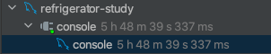

### 6.2.10 Extra
- 성능과 관련된 몇개의 고정된 문장이 표시됨
- 해당 컬럼을 통해 쿼리가 어떤 방식으로 실행이 되고 있는지 알 수 있는 중요한 컬럼  


#### **const row not found(MySQL 5.1 부터)**
- 쿼리 실행 계획에서 const 로 읽었지만 const에 해당하는 레코드가 없음


#### **Distinct**
- 조인하지 않아도 되는 항목은 모두 무시하고 필요한 레코드를 유니크하게 가져오기 위한 표현


#### **Full scan on NULL key**
- col1 IN (select  col2 from ...) 과 같은 쿼리에서 발생함
- col1 이 null 일 경우 해당 연산 조건은 아래와 같음
  - 서브 쿼리가 1건이라도 결과 레코드를 가진다면 최종 비교 결과는 NULL
  - 서브 쿼리가 1건도 결과 레코드를 가지지 않는다면 최종 비교 결과는 FALSE
- 위 두 연산 조건 때문에 서브 쿼리가 1건이라도 데이터가 있는지 없는지 알기 위해서는 full table scan 이 발생한다.
- col1 IN (select  col2 from ...) 조건절 앞에 col1 is not null 조건이 있다면 col1이 null일 경우 실행이 안되기 때문에 해당 상황을 피해갈 수 있다.


#### **Impossible HAVING(MySQL 5.1 부터)**
- HAVING 조건절에 해당하는 레코드가 없을 때 표시되는 키워드
- 쿼리 내용을 다시 점검하는게 좋음

#### **Impossible WHERE(MySQL 5.1 부터)**
- Impossible HAVING 과 비슷하게 WHERE 조건이 항상 FALSE 일 경우 표시되는 키워드
- 쿼리 내용을 다시 점검하는게 좋음

#### **Impossible WHERE noticed after reading const tables**
- 조건을 비교하는 부분에서 옵티마이저가 미리 쿼리를 실행해 볼 수 있고, 이것을 const 방식으로 비교 진행할 수 있을 때(대표적으로 프라이머리키를 기반), 비교 조건에 일치하는 조건이 없을 경우 표시되는 키워드
  
#### **No matching min/max row (MySQL 5.1 부터)**
- MIN(), MAX()와 같은 집합 함수가 있는 쿼리의 조건절에 일치하는 레코드가 없을 때 표시

#### **no matching row in const table (MySQL 5.1 부터)**
- 조인이 사용된 테이블에서 const 방식으로 접근할때 일치하는 레코드가 없다면 표시되는 키워드
  
> const 라는 키워드가 들어가면 옵티마이저가 내부적으로 실행을 해서 상수형식으로 만드는 과정이 있다고 생각하면 편함

#### **No tables used (MySQL 5.0 의 "No tables"에서 키워드 변경됨)**
- from 절이 없는 쿼리에서 표시되는 키워드

#### **Not exists**
- A 테이블에는 존재하지만 B 테이블에는 존재하지 않는 값을 조회할때 안티-조인을 실행하는데 left outer join 을 통해서도 표현 가능
- outer join 을 통해 안티-조인을 실행하면 "Not exists" 형식의 최적화를 통해 실행했다는 것을 표현하는 키워드
- SQL 문법에 NOT EXISTS 와는 다른 의미

#### **Range checked for each record (index map: N)**
- 두 테이블을 조인할때 조건문을 확인해서 매 레코드마다 인덱스 레인지 스캔을 체크해야할 때 표현하는 키워드
- (index map: N) 에서 N은 어떤 인덱스를 후보로 해당 레인지 스캔을 실행하지에 대한 비트가 표시된다.
  ```sql
  select *
    from employees e1, employees e2
   where e1.emp_no <= e2.emp_no;
  ```
  

#### **Scanned N databases(MySQL 5.1부터)**
- INFORMATION_SCHEMA DB를 조회할 때 N개의 DB 정보를 읽었는지 표현하는 키워드

#### **Select tables optimized away**
- MIN(), MAX() 가 사용될때 인덱스를 오름차순/내림차순으로 한건만 읽는 형태의 최적화가 적용되거나 MyISAM 엔진에서 COUNT(*)를 사용할때 표현하는 키워드

#### **Skip_open_table, Open_frm_only, Open_trigger_only, Open_full_table (MySQL 5.1부터)**
- Scanned N databases과 동일하게 INFORMATION_SCHEMA DB의 메타 정보 조회를 할 때 발생한다.
- 메타 정보가 저장된 파일과 트리거가 저장된 파일 또는 데이터 파일 중에서 필요한 파일만 읽었는지 등을 나타낸다.

#### **unique row not found (MySQL 5.1부터)**
- 유니크 컬럼으로 두 테이블을 outer join 하였을때 아웃터 테이블에 일치하는 레코드가 존재하지 않을 때 표시되는 키워드

#### **Using filesort**
- order by 작업시 인덱스를 사용하지 못할때 표시되는 키워드
- 조회된 레코드를 메모리 버퍼에 복사해 퀵소트 알고리즘을 수행하게 됨

#### **Using index(커버링 인덱스)**
- 데이터 파일을 전혀 읽지 않고 인덱스만 읽어서 쿼리를 모두 처리할 수 있을 때 표시되는 키워드
- 인덱스를 이용해 처리할 때 인덱스를 검색해 일치하는 레코드의 나머지 컬럼을 가져오기 위해 데이터 파일을 찾아서 가져오는 작업이 부하가 큰 작업임
- 만약 조회에 필요한 컬럼이 모두 인덱스에 있다면 나머지 컬럼들을 찾기 위한 I/O 작업이 필요 없어짐
- 이렇게 인덱스만으로 처리되는 것을 커버링 인덱스라고 함
- 하지만 너무 과도한 인덱스들은 메모리 낭비와 변경 작업이 느려지는 상황을 발생시킨다

#### **Using index for group-by**
- GROUP BY 처리를 위해 기준 칼럼을 정렬하고 그룹핑 하는 형태의 작업이 이루어짐
- 만약 GROUP BY 처리가 인덱스를 사용한다면 레코드의 정렬이 필요하지 않고 필요한 부분만 읽는 '루스 인덱스 스캔' 을 사용할 수 있다. 
- 하지만 COUNT()나 SUM()과 같은 함수는 모든 레코드를 읽어야 하기 때문에 '루스 인덱스 스캔'을 사용하지 못함
- 또한 WHERE  조건절이 인덱스를 사용하지 않는다면 조건 비교를 위해 '루스 인덱스 스캔'을 사용하지 못함
- WHERE 조건절이 검색을 위해 인덱스를 사용한다고 해도 '루스 인덱스 스캔'에 사용되는 인덱스와 다른 인덱스를 사용할 경우 옵티마이저는 WHERE 절 인덱스를 키준으로 최적화 시키는 경향이 있다.

#### **Using join buffer (MySQL 5.1부터)**
- 일반적으로 조인을 할 때 조인이 되는 칼럼은 인덱스를 생성한다. 두 테이블 모두 필요한 건 아니고 조인에서 뒤에 읽는 테이블의 컬럼에만 필요한다.
- 먼저 읽는 테이블을 드라이빙 테이블, 뒤에 읽히는 테이블을 드리븐 테이블이라고 한다.
- 드리븐 테이블에 검색을 위한 적절한 인덱스가 없다면 드라이빙 테이블로부터 읽은 레코드의 건수만큼 매번 드리븐 테이블을 풀 테이블 스캔이나 인덱스 풀 스캔을 해야한다.
- 그렇기 때문에 드라이빙 테이블에서 읽은 레코드를 임시공간(조인버퍼)에 보관해두고 필요할 때 재사용할 수 있게 해준다.
- 이런 작업이 발생할 때 표시되는 키워드이다.

#### **Using sort_union(...), Using union(...), Using intersect(...)**
- 실행 계획 type 컬럼 값이 index_merge일 경우 2개 이상의 인덱스가 동시에 사용될 수 있다. 
- 이때 두 인덱스로부터 읽은 결과를 어떻게 병합했는지 설명하기위한 키워드
  - Using intersect(...) : 조건이 AND 이고 처리 결과에서 교집합을 추출해 내는 작업
  - Using union(...) : 조건이 OR 이고 처리 결과에서 합집합을 추출해 내는 작업
  - Using sort_union(...) : OR 연결이고 상대적으로 대량의 rnage 조건일 경우 사용

#### **Using temporary**
- 쿼리 처리중 임시 테이블을 사용할때 표시되는 키워드 (임시 테이블이 메모리 또는 디스크에 생성되었는지는 실행계획으로는 알 수 없다.)
- 인덱스를 사용하지 못하는 GROUP BY 쿼리는 실행계획에서 'Using temporary' 메시지가 표시되는 가장 대표적인 형태의 쿼리이다.
- 그리고 해당 키워드가 표시되지 않고도 임시테이블을 이용한 처리를 할 때도 있다.

#### **Using where**
- MySQL 엔진 레이어에서 별도의 가공을 해서 필터링 작업을 처리한 경우에만 해당 키워드가 표시된다.
- 보통 범위제한 조건은 스토리지 엔진레벨에서 처리되지만 체크 조건은 MySQL 엔진 레이어에서 처리된다.
- 해당 키워드는 자주 표시가 되는 키워드라 무시하기 쉽지만 스토리지 엔진과 MySQL 엔진이 이원화 되어 있어서 발생하는 문제점을 나타내는 것일 수도 있다.
- 일반적으로 MySQL 엔진 과 스토리지 엔진이 하나의 프로세스로 동작하는 구조가 아닌 분리되어 있는 NDB 같은 경우 문제가 발생할 확률이 큼
- 인덱스가 필터링 작업이 아닌 범위 작업으로 동작할 수 있도록 해서 문제를 해결할 수 있다.
- 또한 스토리지 엔진 레벨에서 체크 조건도 처리할 수 있도록 하는 기능을 "Condition push down" 이라고한다.

#### **Using where with pushed condition**
- 해당 키워드는 "Condition push down"이 적용됐음을 의미하는 메시지이다.
- 하지만 해당 키워드는 NDB 클러스터 스토리지 엔진을 사용하는 테이블에서만 표시되는 메시지다.
- NDB 에서는 MySQL엔진 역할을 하는 하는 SQL 노드와 스토리지 엔진 연학을 하는 데이터 노드 사이에 "Condition push down" 적용되지 않으면 큰 부하가 있기 때문에 중요한 키워드이다.

### 6.2.11 EXPLAIN EXTENDED (Fitered 칼럼)
