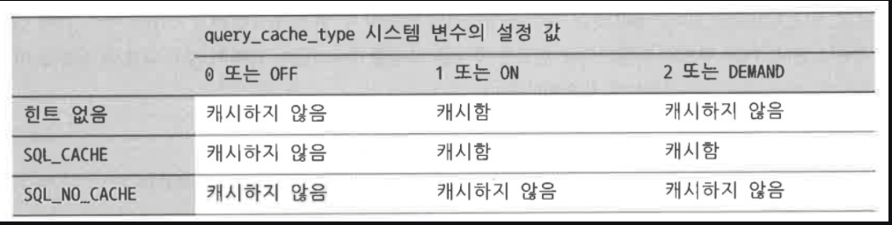

## 7.5. INSERT
하나의 INSERT 문장으로 여러 레코드를 동시에 저장하거나 다른 테이블에서 여러 레코드를 조회해서 그 결과를 INSERT, PK나 유니크 키가 중복된 레코드는 중복 에러가 발생하지 않도록 INSERT 수행하지 않거나 중복 레코드의 존재 여부에 따라 INSERT/UPDATE를 선별적으로 실행, 배치 형태 프로그램에서 많은 레코드를 INSERT해야 할경우가 많음

### 7.5.1. INSERT와 AUTO_INCREMENT
> AUTO_INCREMENT : 순차적으로 증가하는 숫자를 가져오기위한 기능

테이블의 컬럼에 부여하는 옵션형태이므로, 하나의 테이블에서만 순차적으로 증가하게 하며, 테이블의 생성 스크립트에 포함되므로 관리하거나 사용하기가 간편하지만, 여러 테이블에 동시에 사용할 수 없음 -> 동시에 사용할 경우 "시퀀스"

#### AUTO_INCREMENT 제약 및 특성
```sql
INSERT INTO tb_autoincrement (member_name) VALUES ('Georgi Fellona'); -- 일반적
INSERT INTO tb_autoincrement (member_id,member_name) VALUES ('5','Georgi Fellona'); --강제 할당
```
* 강제 저장한 값이 AUTO_INCREMENT의 현재 값보다 작을 때는 AUTO_INCREMENT의 현재 값이 변하지 않는다
* 강제 저장한 값이 AUTO_INCREMENT의 현재 값보다 클때는 AUTO_INCREMENT의 현재 값이 얼마였든지 관계없이 강제로 저장된 값에 1을 더한 값이 AUTO_INCREMENT의 다음 값으로 변경한다.

#### AUTO_INCREMENT 잠금
여러 커넥션에서 AUTO_INCREMENT를 동시에 사용할 때는 동기화 처리가 필요하고,이를 위해 MySQL에서는 AutoIncrement 잠금이라는 테이블 단위의 잠금을 사용한다.
테이블 단위의 잠금이란 특정 시점을 잘라서 볼 때 한 테이블의 AutoIncrement 잠금은 반드시 하나의 커넥션만 가질 수 있다는 것을 의미한다.
하지만 AutoIncrement 잠금은 AUTO_INCREMENT의 현재 값을 가져올 때만 잠금이 걸렸다가 즉시 해제되기 때문에 성능상 문제가 될 때는 거의 없다.
* MAX() -> LAST_INSERT_ID()를 사용 권장

### 7.5.2. INSERT IGNORE
로그나 이력 성격의 테이블과 같이 프라이머리 키나 유니크 키가 중복되는 레코드를 무시해도되는 경우에 쓰임
* INSERT IGNORE 문장이 실패하고 에러가 발생할때
    *  컬럼과 값의 수가 전혀 일치하지 않는 경우
* INSERT IGNORE 문장이 에러 없이 완료되지만 저장되지 않거나 값이 변행되어 저장되는 경우
    * 값이 저장되지 않는 경우
        * 이미 테이블에 프라이머리키나 유니키가 중복이 발생할때
    * 값이 변형이 되어 저장이 되는 경우
        * 컬럼의 입력해야할 타입이 다른경우 > 최대한 비슷한 타입으로 변환하거나 빈문자열 또는 0을 저장

### 7.5.3. REPLACE
> REPLACE는 INSERT와 UPDATE의 기능을 묶은 쿼리와 같은 기능을 한다

REPLACE 문장에서 주의해야 할 점은 중복된 레코드에 대한 판정 기준이고,프라이머리 키나 유니크 키가 있다면 해당 키 모두에 중복된 값이 있는지 체크하고, 있다면 중복되는 레코드를 전부 삭제하고 넣으려는 데이터를 삽입한다.

### 7.5.4. INSERT INTO ... ON DUPLICATE KEY UPDATE ...
REPLACE와 흡사하지만 중복된 레코드를 삭제하지 않고 UPDATE한다는 것이 유일한 차이다.

### 7.5.5. INSERT ... SELECT ...
특정 테이블로 부터 레코드를 읽어 그 결과를 INSERT이고, INSERT 대상 테이블과 SELECT 대상 테이블이 동일한경우에 사용할수 없고, SELECT 대상 테이블의 읽기 잠금이 필요

### 7.5.6. LOAD DATA (LOCAL) INFILE
csv 파일 포맷 또는 일정한 규칙을 지닌 구분자로 구분된 데이터 파일을 읽어 MySQL 서버의 테이블로 적재한다. 일반적인 insert 쿼리에 비해 20배 정도 빠르다고 한다.

#### 데이터 파일의 값과 테이블의 칼럼의 개수가 동일할 경우
동일하게 값이 세팅되어서 들어감

#### 데이터 파일의 값의 개수가 테이블의 칼럼 수보다 적은 경우
테이블의 컬럼의 NULL허용에 따라서 초기값을 세팅할지, 기본 초기값으로 세팅되어서 들어갈지 결정

#### 데이터 파일의 값의 개수가 테이블의 칼럼 수보다 많은 경우
데이터 파일의 있는 값을 버림

#### 데이터 파일이 MySQL 서버가 아닌 다른 컴퓨터에 있을 경우
local 키워드를 추가하여 사용하면 클라이언트의 파일을 사용할 수 있다

#### LOAD DATA INFILE의 성능 향상
* auto-commit
    * auto-commit이 활성화되면 insert 할 때마다 commit을 실행하는데 이는 매번 레코드 단위로 로그 파일의 디스크 동기화 작업을 발생시킨다. 그래서 이를 비활성화하면 이러한 단점을 해결
* unique index
    * unique_checks 설정을 비활성화해서 중복 체크를 피할 수 있다.
* foreign key
    * foreign_key_checks 설정을 변경하면 무결성 체크를 수행하지 않고 바로 적제 가능하다. 이 또한 무결성을 해치는 데이터가 없다는 것을 미리 확인해야 한다.

#### LOAD DATA 명령의 문자집합 처리
테이블에 적재하기 전에 문자 셋에 주의해야 한다. 그렇지 않은 경우 문자가 깨진 상태로 테이블에 적재될 수도 있다.   

# 7.6. UPDATE
코드의 값을 변경하는 형태가 자주 사용된다. MySQL에서는 기본적인 형식 말고도 정렬해서 업데이트 하거나 여러 테이블을 조인해서 2개 이상의 테이블을 동시에 변경하는 처리도 가능하다. 이 경우는 조인의 순서가 중요하게 된다.

### 7.6.1. UPDATE ... ORDER BY ... LIMIT n
 - MySQL에서는 update 쿼리에 order by 절과 limit 절을 동시에 사용해 특정 값으로 정렬해서 그 중에서 상위 몇 건만 업데이트 하는 것도 가능
 - limit 절은 있지만 order by 절이 없는 update 쿼리는 복제에서 마스터 역할을 하는 MySQL 서버에서는 사용하지 않는 편이 좋다. 따로 정렬 규칙이 존재하지 않기 때문에 마스터와 슬래이브에서 100% 달라질 수 밖에 없다.

### 7.6.2. JOIN UPDATE
- 두 개 이상의 테이블을 조인해 조인된 결과 레코드를 업데이트하는 쿼리를 join update라고 한다. 조인된 테이블 중에서 특정 테이블의 칼럼 값을 이용해 다른 테이블의 칼럼에 업데이트해야 할 때 join update를 주로 사용한다. 또는 조인되는 양쪽 테이블에 공통적으로 존재하는 레코드만 찾아서 업데이트하는 용도로 사용할 수 있다.
- join update는 모든 테이블에 대해 읽기 참조만 되는 테이블은 읽기 잠금이, 칼럼이 변경되는 테이블은 쓰기 잠금이 걸린다. 그래서 웹 서비스와 같은 OLTP 환경에서는 데드락을 유발할 가능성이 높으므로 많이 사용하지 않는 것이 좋다. 그러나 배치 프로그램이나 통계용 update 쿼리에서는 유용하게 사용할 수 있다.
```sql
update departments d, dept_emp de
set d.emp_count = count(*)
where de.dept_no = d.dept_no group by de.dept_no; -- 동작하지 않음

update departments d, (select de.dept_no, count(*) as emp_count from dept_emp de group by de.dept_no) dc
set d.emp_count = dc.emp_count
where dc.dept_no = d.dept_no;
```
위 쿼리는 이처럼 에러를 발생시킨다. 그 이유는 join update 쿼리에서는 group by를 문법적으로 지원해주지 않기 때문이다. 이를 서브 쿼리를 이용한 파생 테이블을 통해 해결할 수 있다.
> 일반 테이블에 조인될 때는 임시 테이블이 드라이빙 테이블이 되는 것이 일반적으로 빠른 성능을 보여준다. 만약 원하는 조인의 방향을 옵티마이저에게 알려주고 싶다면 join update 쿼리에 straight_join이라는 키워드를 사용하면 된다.

## 7.7 DELETE

### 7.7.1 DELETE ... ORDER BY ... LIMIT n

### 7.7.2 JOIN DELETE
join delete 쿼리의 경우 join delete와 from 절 사이에 삭제할 테이블을 명시해야 한다. 물론 하나의 테이블에서만 레코드를 삭제할 수 있는 것은 아니다.

## 7.8. 스키마 조작 (DDL)
데이터베이스의 구조 및 정의를 생성하거나 변경하는 쿼리를 DDL(Data Definition Language)이라 한다. 스토어드 프로시저나 함수, 그리고 DB나 테이블 등을 생성하거나 변경하는 대부분의 명령이 해당한다.
인덱스 칼럼을 추가하고 삭제하는 작업은 테이블의 모든 레코드를 임시 테이블로 복사하면서 처리되므로 매우 주의해야 한다.

### 7.8.1 데이터베이스

#### 데이터베이스 생성
```sql
create database [if not exists] employees;
create database [if not exists] employees character SET utf8;
create database [if not exists] employees character SET utf8 collate utf8_general_ci;
```
첫 번째 명령은 기본 문자집합과 콜레이션으로 데이터베이스를 생성한다. 두 번째와 세 번째 명령은 별도의 문자집합과 콜레이션이 지정된 데이터베이스를 생성한다.

if not exists 키워드를 사용하면 기존에 동일한 이름의 데이터베이스가 없는 경우 생성되고 있는 경우는 명령이 무시된다. (위 키워드를 사용하지 않은 상태에서 중복된 이름의 데이터베이스가 존재한다면 에러가 발생한다)
#### 데이터베이스 목록
```sql
show databases;
show databases like '%emp%';
```
MySQL 서버가 가지고 있는 데이터베이스의 목록을 나열한다. 이 명령을 실행하기 위해서는 권한이 필요하다.

#### 데이터베이스 선택
```sql
use employees;
```
기본 데이터베이스를 선택하는 명령이다. SQL 문장에서 별도로 데이터베이스를 명시하지 않으면 기본 데이터베이스를 기준으로 테이블이나 프로시저를 검색한다. 만약 기존 데이터베이스가 아닌 테이블 또는 프로시저를 사용하고 싶다면 데이터베이스 이름을 명시해야 한다.

#### 데이터베이스 속성 변경
```sql
alter database employees character set=euckr;
alter database employees character set=euckr collate=euckr_korean_ci;
```
문자집합이나 콜레이션을 변경한다.

#### 데이터베이스 삭제
```sql
drop database [if exists] employees;
```
데이터베이스를 삭제한다. create와 마찬가지로 if exists 키워드를 사용하면 존재하면 삭제하고 그렇지 않으면 명령을 무시한다.

### 7.8.2. 테이블

#### 테이블 생성
```sql
create [temporary] table [if not exists] tb_test (
...
) engine=innodb
```
#### 테이블 구조 조회
##### SHOW CREATE TABLE
컬럼의 목록과 인덱스, 그리고 외래키 정보를 동시에 보여주고, 특별한 수정없이 create table 명령을 만들어주기 때문에 유용
##### DESC 또는 DESCRIBE
테이블의 컬럼 정보를 보기 좋게 표 형태로 표시해주지만 인ㄷ게스나 외래키 그리고 테이블 자체의 속성을 보여주지는 않으므로, 테이블의 전체적인 구조를 한번에 확인하기는 어렵다.

#### 테이블 구조 변경
alter table 명령은 테이블 자체의 속성을 변경할 수 있고 인덱스의 추가나 삭제, 컬럼을 추가나 삭제하는 용도로 사용된다.
테이블 자체에 대한 속성 변경은 테이블의 문자집합이나 스토리지 엔진, 파티션 구조 등의 변경
```sql
alter table employees character set 'euckr';
alter table employees character engine=myisam;
```
- 첫 번째 명령은 기존의 컬럼의 문자집합을 변경하진 않고 앞으로 추가될 컬럼에 대한 문자집합만 변경하는 명령이다.
- 두 번째 명령은 테이블의 스토리지 엔진을 변경하는 명령이다. 
    - 이 명령은 내부적인 테이블의 저장소를 변경하는 것이라서 항상 테이블의 모든 레코드를 복사하는 작업이 필요하다. 만약 동일한 엔진을 입력했더라도 변경이 일어나니 주의해야 한다.
- innodb의 경우 컬럼을 추가하거나 삭제하는 작업 모두 테이블 리빌드가 일어난다.

#### RENAME TABLE
테이블의 이름을 변경하는 용도인데, 크게 2가지 용도로 사용된다.
##### 테이블의 이름 변경
##### 테이블의 DB 변경
테이블을 A 데이터베이스에서 B 데이터베이스로 옮길 때도 유용하다.
```sql
rename table db1.employees to db2.employees;
```
#### 테이블 상태 조회
```sql
show table status
```
명령을 사용하면 테이블의 상세 정보를 얻을 수 있다. 테이블이 어떤 스토리지 엔진을 사용하는지, 데이터 파일의 포맷을 뭘 사용하는지 등을 알 수 있다. row의 갯수도 확인 가능하다

#### 테이블 구조 복사
```sql
show create table
```
명령을 이용해 테이블 생성 DDL을 조회한 후 이를 변형해서 새로운 테이블을 만들 수 있다. 또는 create table ... as select ... limit 0 명령으로 테이블을 생성할 수도 있다.
#### 테이블 삭제
```sql
drop table
```
레코드 건수가 많은 테이블의 경우 테이블 삭제는 상당히 부하가 큰 작업에 속하기 때문에 서비스 도중에 삭제 작업은 수행하지 않는 것이 좋다

### 7.8.3. 컬럼 변경

#### 컬럼 추가
```sql
alter table employees add column emp_telno varchar(20);
alter table employees add column emp_telno varchar(20) after emp_no;
```
#### 컬럼 삭제
```sql
alter table employees drop column emp_telno;
```

#### 컬럼명을 변경하는 경우
```sql
alter table employees change column first_name varchar(14) not null;
```
#### 컬럼명 이외의 타입이나 null 여부를 변경하는 경우
```sql
alter table employees modify column first_name varchar(200) not null;
```
#### 컬럼 변경을 위한 ALTER TABLE 진행 상황
```sql
show global status like 'Handler%';
```

### 7.8.4. 인덱스 변경
#### 인덱스 추가
innodb의 경우 MySQL 5.1부터 데이터 자체는 그대로 두고 인덱스만 생성하는 형태로 개선됐다. 예외적으로 PK의 경우 여전히 모든 레코드를 복사하면서 처리한다.
```sql
alter table employees add primary key [using {btree | hash}] (emp_no);
alter table employees add unique index [using {btree | hash}] ux_emptelno (emp_telno);
alter table employees add index [using {btree | hash}] ix_emptelno (emp_telno);
alter table employees add fulltext index fx_emptelno (emp_telno);
alter table employees add spatial index fx_emptelno (emp_telno);
```
- primary key : 테이블의 프라이머리 키를 생성하는 키워드, 어떤 스토리지 엔진이든 가능.
- unique index : 키 값의 중복을 허용하지 않는 인덱스를 생성하는 키워드, 스토리지 엔진에 관계없이 사용할 수 있음.
- fulltext index : 전문 검색 인덱스를 생성하는 키워드, MyISAM 스토리지 엔진을 사용하는 테이블에만 가능.
- spatial index : 공간 검색 인덱스를 생성하는 키워드, MyISAM 스토리지 엔진을 사용하는 테이블에만 가능.
- index : 특별한 키워드를 명시하지 않고 index 키워드만 사용하면 중복이 허용되는 일반 보조 인덱스를 생성.
> using 키워드를 사용해 인덱스 알고리즘을 선택할 수 있다. 주로 B-Tree나 Hash가 사용,명시하지 않으면 각 엔진에 따른 기본 알고리즘으로 생성(MyISAM/InnoDB -> B-TREE)
#### 인덱스 조회
```sql
show index from 테이블명
```
명령의 결과는 인덱스의 칼럼 단위로 한 라인씩 표시되며, 각 컬럼의 콜레이션이나 인덱스 알고리즘 등이 모두 표시된다. 그리고 가장 중요한 인덱스의 기수성(Cardinality)도 표시
> 기수성 : 특정 데이터 집합의 유니크(Unique)한 값의 개수, 기수성(Cardinality) 값이 높은 컬럼을 인덱스로 설정하였을 때 성능이 좋음

#### 인덱스 삭제
```sql
alter table employees drop primary key;
alter table employees drop index ix_emptelno;
```
MyISAM 테이블은 인덱스 생성과 삭제 모두 기존의 방식(임시 테이블에 복사)과 같다. 그러나 InnoDB 테이블의 경우 MySQL 5.1부터 데이터는 그대로 두고 인덱스만 삭제하기 때문에 훨씬 빠르게 처리한다. 인덱스 삭제는 alter table drop index 명령을 실행함과 거의 동시에 완료된다. primary key의 경우 예전과 동일하게 동작한다. 이는 InnoDB의 프라이머리 키가 클러스터링 키이기 때문이다.
#### 컬럼 및 인덱스 변경을 모아서 실행
```sql
alter table employees
  drop index ix_firstname,
  add index ix_new_firstname (first_name),
  add column emp_telno varchar(15);
```
#### 인덱스 생성을 위한 ALTER TABLE 진행 상황
- InnoDB, MySQL 5.1과 5.5 이상의 InnoDB 테이블
    - 임시 테이블을 사용하지 않고 인덱스 삭제의 경우 즉시 완료된다. 인덱스 신규 생성의 경우 상태 값을 모니터링하면서 진행 상황을 파악할 수 있다. Handler_read_rnd_next 상태 값의 변화만으로 진행 상황을 확인할 수 있다.

- MySQL 5.0의 InnoDB 테이블과 모든 MyISAM 테이블
    - 모두 임시 테이블로 복사해서 작업하므로 기존의 진행상황 파악 방법을 사용하면 된다.


### 7.8.5. 프로세스 조회
```sql
show processlist
```
### 7.8.6. 프로세스 강제 종료
```sql
kill query 4228;
kill 4228;
```
how processlist 명령에서 얻어낸 id를 사용해서 특정 쿼리나 커넥션을 종료
### 7.8.7. 시스템 변수 조회 및 변경
```sql
show global variables;
show global variables like '%connections%';
```
### 7.8.8. 경고나 에러 조회
```sql
show warnings 
```
에러가 발생하면 바로 쿼리가 종료되고 에러메시지가 출력되지만 경고나 정보성 메시지는 출력되지 않는다. 이는 show warnings 명령을 통해 확인 가능하다.
### 7.8.9. 권한 조회
```sql
show privilege; -- 조회
show grants for 'root'@'localhost'; -- 권한부여
```

## 7.9. SQL 힌트
> 힌트 : SQL 문장에 특별한 키워드를 지정해 MySQL 옵티마이저에게 어떻게 데이터를 읽는 것이 최적인지 알려주는 것
### 7.9.1 힌트의 사용법
```sql
SELECT * FROM employees USE INDEX (PRIMAY) WHERE emp_no=10001;
SELECT * FROM employees /*! USE INDEX (PRIMARY)*/ WHERE emp_no=10001;
```
### 7.9.1. STRAIGHT_JOIN
```sql
SELECT STRAIGHT_JOIN e.first_name, e.last_name, d.dept_name
FROM employees e, dept_emp de, departments d
WHERE e.empt_no=de.emp_no AND d.dept_no=de.dept_no;

SELECT /*! STRAIGHT_JOIN */ e.first_name, e.last_name, d.dept_name
FROM employees e, dept_emp de, departments d
WHERE e.empt_no=de.emp_no AND d.dept_no=de.dept_no;
```
STRAIGHT_JOIN 힌트는 옵티마이저가 FROM절에 명시된 테이블의 순서대로 조인을 수행하도록 유도. 여기서 FROM 절이란 INNER JOIN이나 LEFT JOIN까지 모두 포함
- 임시테이블(인라인 뷰 또는 파생된 테이블)과 일반 테이블의 조인
    - 임시 테이블을 드라이빙 테이블로 선정하는 것이 옳다. 일반 테이블의 조인 칼럼에 인덱스가 없다면 레코드 건수가 적은 쪽을 드라이빙 테이블로 선택해 먼저 읽게 하는 것이 좋다.
- 임시 테이블끼리의 조인
    - 서브 쿼리로 파생된 임시 테이블은 인덱스가 없으므로 어느 테이블을 먼저 읽어도 무방하다. 일반적으로 크기가 작은 테이블을 드라이빙 테이블로 선택하는 것이 좋다.
- 일반 테이블끼리의 조인
    - 양쪽 테이블 모두 조인 칼럼에 인덱스가 있거나 양쪽 테이블 모두 조인 칼럼에 인덱스가 없는 경우에는 레코드 건수가 적은 테이블을 드라이빙으로 두는 것이 좋다. 그 외에는 조인 칼럼에 인덱스가 없는 테이블을 드라이빙으로 선택하는 것이 좋다.
> '레코드 건수'는 조건을 만족하는 레코드 건수를 의미하지, 테이블 전체의 레코드 건수를 의미하지는 않는다.

### 7.9.3. USE INDEX / FORCE INDEX / IGNORE INDEX
복잡한 인덱스에 대해 MySQL 옵티마이저가 적합한 인덱스를 선택하지 못할 때는 USE INDEX나 FORCE INDEX 힌트로 옵티마이저가 다른 인덱스를 사용하도록 유도할 수 있다.
인덱스 힌트는 사용하려는 인덱스가 포함된 테이블 뒤에 힌트를 명시해야 한다. 이 3가지 인덱스 힌트 모두 키워드 뒤에 인덱스의 이름을 괄호로 묶어서 사용하는데 괄호 안에 아무것도 없거나 존재하지 않는 인덱스 이름을 사용할 때는 문법 오류가 나면서 종료된다. 프라이머리 키는 "PRIMARY"라는 키워드를 사용하면 된다

- USE INDEX: 가장 자주 사용되는 인덱스 힌트. MySQL 옵티마이저에게 특정 테이블의 인덱스를 사용하도록 권장.
- FORCE INDEX: USE INDEX와 다른점 없이 USE INDEX보다 옵티마이저에게 미치는 영향이 더 강한 힌트. 5.1 이전 버전에서는 FORCE INDEX()로 빈 괄호를 주어 아무 인덱스도 사용하지 않는다는 의미로 사용되기도 했는데 5.1 이상 버전에서는 문법 오류로 판단되어 주의해야 한다.
- IGNORE INDEX: 두 힌트와 반대로 특정 인덱스를 사용하지 못하게 만드는 용도로 사용하는 힌트다. 옵티마이저가 풀 테이블 스캔을 사용하도록 유도하고 싶다면 IGNORE INDEX를 사용하면 된다.
- USE INDEX FOR JOIN: 테이블 간의 조인뿐 아니라 레코드를 검색하는 용도까지 포함한다.
- USE INDEX FOR ORDER BY: 명시된 인덱스를 ORDER BY 용도로만 사용하도록 제한.
- USE INDEX FOR GROUP BY: 명시된 인덱스를 GROUP BY 용도로만 사용하도록 제한.

### 7.9.4. SQL_CACHE / SQL_NO_CACHE
- SELECT 쿼리에 의해 만들어진 결과를 재사용하기 위해 쿼리 캐시에 선택적으로 저장.
- 이 결과를 쿼리 캐시에 담아 둘지 여부를 쿼리에서 직접 선택할 수도 있는데 이 때 사용하는 힌트
- query_cache_type이라는 시스템 변수의 설정에 의해 기본적으로 쿼리의 결과를 쿼리 캐시에 저장할지 말지가 결정.
 
- 성능 분석을 위해 쿼리를 실행할 때는 SQL_NO_CACHE 힌트를 사용하는 것이 좋음.
- 이 힌트는 SELECT 쿼리 문장에서만 사용할 수 있고, SELECT 키워드 바로 뒤에 입력해야 함.

```sql
SELECT SQL_NO_CACHE COUNT(*) FROM employees WHERE last_name='Facello';
SELECT /*! SQL_NO_CACHE */ COUNT(*) FROM employees WHERE last_name='Facello';
```

### 7.9.5 SQL_CALC_FOUND_ROWS

- SELECT 시에 LIMIT 절이 사용되면 조건을 만족하는 레코드가 LIMIT 절에 명시된 수보다 많으면 그만큼 레코드를 찾고, 즉시 쿼리 수행을 멈춤
- SQL_CALC_FOUND_ROWS 힌트가 사용된 쿼리에서는 LIMIT 절과 관계없이 일치하는 모든 레코드를 검색해서 전체 조건에 일치하는 레코드가 몇 건이나 되는지 계산하고 사용자에게는 LIMIT에 제한된 건수만큼의 레코드만 반환.
- 이 힌트가 사용된 쿼리 실행 후에는 FOUND_ROWS()라는 함수를 이용해 전체 레코드가 몇 건이었는지를 가져올 수 있다.
```sql
SELECT SQL_CALC_FOUND_ROWS * FROM employees LIMIT 5;

SELECT FOUND_ROWS() AS total_record_count;
```
- 두 번째 쿼리는 첫 번째 쿼리가 실행되면서 현재 커넥션의 세션 변수에 저장해둔 값을 가져와서 보여주기만 하는 것.
- 하지만 보통 이 경우에는 일치하는 모든 레코드를 찾기 위해 일치하는 모든 레코드를 읽어야하므로 비효율적인 경우가 많아 사용하지 않는 것이 좋다.

### 7.9.6 기타 힌트 
- SQL_BIT_RESULT, SQL_SMALL_RESULT, SQL_BUFFER_RESULT, HIGH_PRIORITY 등의 힌트도 있지만 거의 사용되지 않기 때문에 시간적 여유가 있다면 한 번..찾아보자

## 7.10 쿼리 성능 테스트 
- 쿼리를 직접 실행해 보면서 눈으로 성능을 체크할 때는 여러 가지 방해 요소가 있는데, 간단하게 쿼리의 성능을 판단해보기 위해서 어떤 부분을 고려해야 하고, 어떤 변수가 있는지 살펴보자.
### 7.10.1 쿼리의 성능에 영향을 미치는 요소
- MySQL 서버가 가지고 있는 여러 종류의 버퍼나 캐시가 성능 판단에 큰 변수로 작용한다. 어떤 버퍼나 캐시가 영향을 미치는지 살펴보고, 영향력을 최소화하는 방법도 알아보자.
#### 운영체제의 캐시
- MySQL 서버는 운영체제의 파일 시스템 관련 기능(시스템 콜)을 이용해 데이터 파일을 읽어옴.
- 일반적으로 대부분의 운영체제는 한 번 읽은 데이터는 운영체제가 관리하는 별도의 캐시 영역에 보관해 뒀다가 다시 해당 데이터가 요청되면 디스크를 읽지 않고 캐시의 내용을 바로 반환.
- InnoDB 스토리지 엔진은 일반적으로 파일 시스템의 캐시나 버퍼를 거치지 않는 Direct I/O를 사용하므로 운영체제 캐시가 그다지 큰 영향을 미치지 않음.
- MyISAM 스토리지 엔진은 운영체제의 캐시에 대한 의존도가 높기 때문에 운영체제의 캐시에 다라 성능 차이가 큰 편.

#### MySQL 서버의 버퍼 풀(InnoDB 버퍼 풀과 MyISAM의 키 캐시)
- MySQL 서버에서도 데이터 파일의 내용을 페이지(또는 블록) 단위로 캐시하는 기능을 제공.
- InnoDB 스토리지 엔진이 관리하는 캐시를 버퍼 풀이라고 하며, MyISAM 스토리지 엔진이 관리하는 캐시는 키 캐시.
- MyISAM 스토리지 엔진에서는 인덱스를 제외한 테이블 데이터는 모두 운영체제의 캐시에 의존. 
- 쿼리 캐시를 사용하지 못하도록 힌트를 사용한 쿼리라 하더라도 처음 실행시와 두 번째 실행시에 성능차이가 발생할 수도 있음. 이는 버퍼 풀이나 키 캐시에 의한 성능 차이. 일반적으로 서비스 쿼리는 버퍼 풀이나 키 캐시가 준비된 상태에서 실행되기 때문에 처음 실행했을 때의 결과는 버리고 여러 번 테스트해서 그 결과를 기준으로 판단.

#### MySQL 쿼리 캐시
- 쿼리 캐시는 이전에 실행됐던 SQL 문장과 그 결과를 임시로 저장해두는 메모리 공간.
- 쿼리 캐시에서 결과를 가져온 경우네는 대부분 0.00초 내에 쿼리 결과가 반환.
- "RESET QUERY CACHE" 명령으로 쿼리 캐시에 저장된 데이터를 비울 수 있음. 다만 이는 작업이 진행되는 동안 모든 쿼리의 실행이 대기해야 하므로 서비스 중인 MySQL 서버에서는 주의해야 한다.

#### 독립된 MySQL 서버
- MySQL 서버뿐 아니라 테스트 쿼리를 실행하는 클라이언트 프로그램이나 네트워크의 영향 요소도 고려해야 함.
- 쿼리의 성능 테스트를 MySQL 서버의 상태가 워밍업된 상태에서 진행할지 아니면 콜드 상태에서 진행할지도 고려해야 함. 
- 일반적인 테스트는 워밍업 상태를 가정하고 테스트. 실제 서비스 환경에서 워밍업 상태로 전환되는데 그다지 많은 시간이 걸리지 않기 때문에 대부분 운영 환경은 워밍업 상태에서 실행된다고 볼 수 있음.

### 7.10.2 쿼리의 성능 테스트
- 쿼리 성능 테스트를 위해서 쿼리를 실행할 때 너무 많은 레코드가 화면에 출력되려면 이 부분에 더 많은 시간이 걸릴 수 있음.
- SQL_CALC_FOUND_ROWS 힌트와 LIMIT 0을 사용하여 레코드를 화면에 출력하지 않고 전체 처리 시간을 확인할 수 있음.
- 다음과 같이 PAGER 옵션을 변경하여 결과의 출력을 다른 곳으로 보내거나 버리는 방법도 가능. 유닉스 계열이라면 PAGER 옵션을 변경해서 출력되는 결과를 간단히 /dev/null로 리다이렉트 할 수 있음. 화면에는 소요된 시간만 출력됨.

```sql
mysql> PAGER /dev/null
mysql> SELECT .. FROM employees ...
-> 2 rows in set (0.00sec)
mysql> NOPAGER
```
- 웜업 시간을 버리고 실행시간을 측정하면 첫 번째 쿼리가 12.1초 정도고 두 번째부터 여섯 번째까지의 평균이 2.3초인데, 이 차이가 버퍼 풀의 크기나 CPU의 성능, 전체 메모리 크기 또는 디스크 사양에 따라 이 크기 차이가 달라지게 됨.

### 7.10.3 쿼리 프로파일링
- 쿼리 프로파일링이란 쿼리가 처리되는 동안 각 단계별 작업에 시간이 얼마나 걸렸는지 확인하여 쿼리의 성능을 예측하거나 개선하는데 도움을 주는 것..
- MySQL 5.1 이상 버전에서만 지원. 기본적으로는 활성화되어 있지 않고, 필요하담면 프로파일링을 활성화해야 함. 
```sql
SHOW VARIABLES LIKE 'profiling';
SET PROFILING=1;
```

- 프로파일 기능을 활성화하면 간단하게 쿼리 한 두개를 실행하고 각 쿼리에 대한 프로파일 내용을 확인할 수 있음.
```sql
SELECT * FROM employees WHERE emp_no=10001;
SELECT COUNT(*) FROM employees WHERE emp_no BETWEEN 10001 AND 12000 GROUP BY first_name;
SHOW PROFILES;
```
- 프로파일링 정보는 모든 쿼리에 대해 저장되는 것이 아니라 최근 15개의 쿼리에 대해서만 저장됨. 그 이상 저장하려면 profiling_history_size 시스템 설정 변수를 조정하면 되는데, 최대 가능한 값은 100.
- 특정 쿼리의 상세 프로파일링 정보를 조회하려면 "SHOW PROFILE FOR QUERY <쿼리번호>" 명령을 실행하면 됨.
- 가장 최근 실행된 쿼리의 상세 프로파일링 정보를 조회하려면 "SHOW PROFILE" 명령만 실행하면 됨.
- 각 쿼리의 프로파일링 정보 중 CPU나 MEMORY 또는 DISK와 관련된 내용만 구분해서 확인도 가능. SHOW PROFILE <CPU | BLOCK IO | MEMORY | ...> FOR QUERY <쿼리 번호> 로 조회 가능.


# 8. 확장기능
## 8.1. 전문 검색
> 게시물의 내용이나 제목 등과 같이 문장이나 문서의 내용에서 키워드를 검색하는 기능이다.
### 8.1.1. 전문 검색 엔진의 종류와 특성
- MySql 빌트인 전문검색, 트리톤, mGroonga
- 트리톤, mGroonga : N-그램 방식의 인덱싱을 지원하기 때문에 단어나 어휘를 고려하지 않고 본문의 내용을 잘라서 모두 인덱스로 만듬
- 구분자 방식의 인덱싱 : 띄어쓰기나 특수 문자로 단어를 구분해서 저문 인덱스를 구축하는 방식
    - 인위적으로 여러 개의 값을 구분자로 연결해서 문자열을 만들고, 그 문자열 값을 검색할 때 자주 사용

### 8.1.2. MySQL 빌트인 전문 검색
- MyISAM 스토리지 엔진에서 사용하는 테이블에서만 사용 가능하며, 구분자(Stopword) 기반의 키워드 추출 알고리즘을 사용하기 때문에 지정된 구분자에 의해서만 인덱싱이 처리
- 단순히 공백이나 띄어쓰기 또는 특수 문자로 키워드를 추출하는 데 충분하다면 별다른 변경 없이 MySQL 빌트인 전문 검색 엔진을 그대로 사용

#### 빌트인 전문 검색 엔진의 설정
#### ft_stopword_file
- 기본적으로 영문자를 대상으로 준비되어 있는데, 기본 구분자에서 삭제하거나 새로운 구분자를 추가하려면 별도 파일에 저장해서 등록을 해야한다 > ...굳이 쓸필요가 있을까?
- 만약쓴다면..
    - 파일 등록(''로 감싸고, ','로 구분)
    - my.cnf 설정파일의 ft_stopword_file 시스템 변수에 설정하고 MySQL 서버를 재시작
#### ft_min_word_len
- 인덱스에 추가할 키워드의 최소길이를 지정
- 일반적으로 4글자 이상만 인덱스에 포함 > ...굳이 쓸필요가 있을까?
- 만약쓴다면...
    - ft_stopword_file과 방식 그대로 진행
#### ft_max_word_len
- ft_min_word_len와 반대로 최대길이를 지정

#### 전문 검색 쿼리
- MATCH() ... AGAINST() 구문을 사용
- 영문 대소문자 구분이 필요시, 전문 검색 대상 컬럼의 콜레이션을 "_bin"이나 "_cs"계열로 변경
##### 자연어 모드
```sql
CREATE TABLE ft_article (
  doc_id INT NOT NULL,
  doc_title VARCHAR(1000) NOT NULL,
  doc_body TEXT,
  PRIMARY KEY (doc_id),
	FULLTEXT KEY fx_article (doc_title,doc_body)
	
) ENGINE=MyISAM DEFAULT CHARSET=utf8;

INSERT INTO ft_article VALUES
(1, 'it is possible', 'it is possible to subpartition tables that are partitioned by RANGE or LIST'),
(2, 'Subpartitions may', 'Subpartitions may use either HASH or KEY partitioning'),
(3, 'This is also', 'This is also known as composite partitioning'),
(4, 'SUBPARTITION BY HASH', 'SUBPARTITION BY HASH and SUBPARTITION BY KEY generally follow the same syntax rules'),
(5, 'An exception', 'An exception to this is that SUBPARTITION BY KEY (unlike PARTITION BY KEY)');

select * from ft_article fa 
where MATCH (doc_title ,doc_body) AGAINST('key hash')
;
```
- 입력된 검색어에서 키워드를 추출한 뒤에 키워드를 포함 하느 레코드를 검색하는 방법
- 자연어 검색모드에서는 전체 테이블에서 50%이상의 레코드가 검색왼 키워드를 가지고있으면, 검색어로 의미가 없다고 판단하고 검색 결과에서 배제
- 전문 검색 엔진을 사용할때 MATCH()의 괄호 안에는 만들어진 전문 인덱스에 포함된 모든 컬럼이 명시되어야함

##### 불리언 모드 
- 각 키워드의 포함 및 불포함 비교를 수행하고, 그 결과를 TRUE or FALSE 형태로 연산해서 최종 일치 여부를 판단하는 검색 방법
> \+ : 키워드 앞에 '+' 연산자가 표시되면 AND 연산을 의미
<br> \- : 키워드 앞에 '-'가 표시되면 NOT 연산을 의미
<br> 연산자 없음 : 만약 키워드 앞에 아무 연산자도 명시되지 않고, 키워드만 명시되면 OR 연산을 의미

```sql
select * from ft_article fa 
where MATCH (doc_title,doc_body) against('+hash +syntax' in boolean mode)

select * from ft_article fa 
where MATCH (doc_title,doc_body) against('+hash -syntax' in boolean mode)

select doc_id ,doc_title , doc_body ,
		MATCH (doc_title,doc_body) against('hash syntax' in boolean mode) as match_scord
from ft_article fa 
where MATCH (doc_title,doc_body) against('hash syntax' in boolean mode)

```
### 8.1.3. 트리톤 전문 검색
### 8.1.4. mGroonga 전문 검색

## 8.2. 공간검색
### 8.2.1. R-Tree 인덱스를 사용하는 이유

### 8.2.2. 위도나 경도 정보를 이용한 거리 계산
### 8.2.3. R-Tree를 이용한 위치 검색
